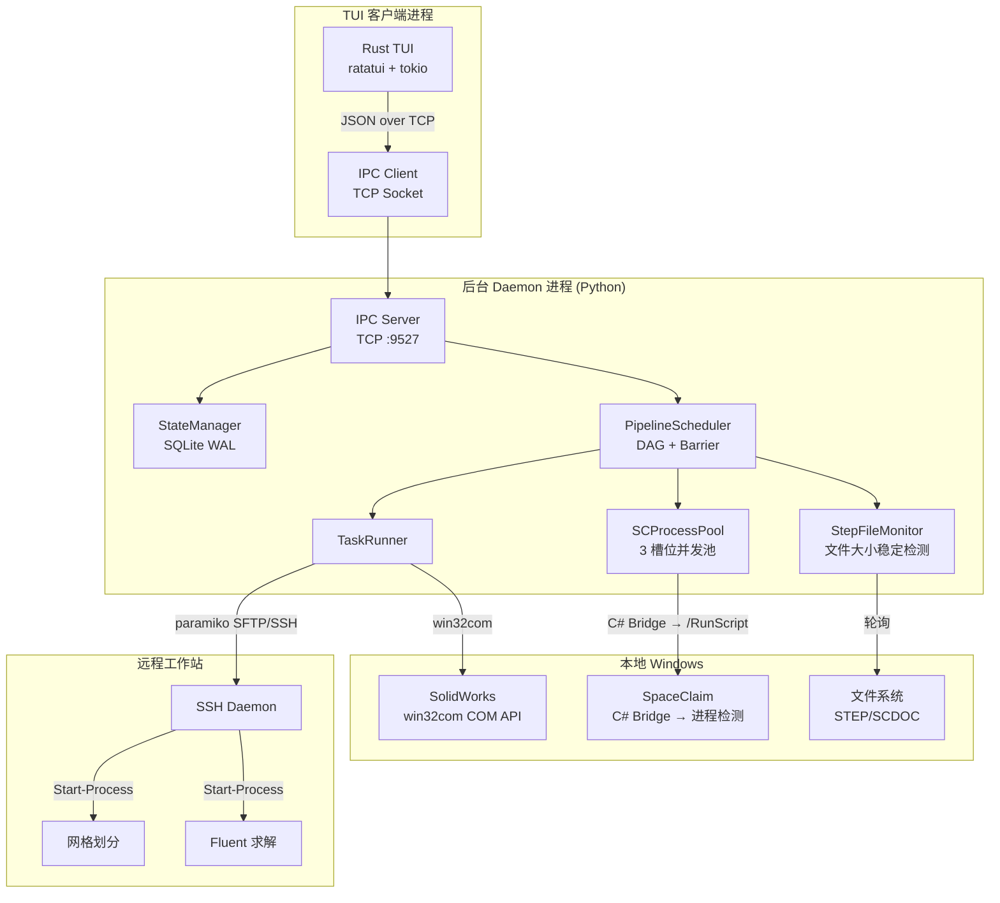

# 🚀 AutoFluid — 火箭发动机 CFD 仿真全自动流水线

> **Pipeline Daemon Engine v2.5.1** — Client/Server 分离架构的批量仿真调度系统

***

## 项目概述

AutoFluid 是一个**全自动 CFD 仿真流水线控制系统**，用于批量执行火箭发动机喷注器构型的计算流体动力学仿真。系统自动串联 **SolidWorks 参数化建模 → SpaceClaim 几何转换 → SFTP 远程传输 → 网格划分 → Fluent 求解** 五个阶段，将上百个构型的人工逐一操作变为无人值守全自动运行。

### 核心特性

- **全自动五阶段流水线**: 从 Excel 参数表读取构型，自动完成建模→转换→传输→网格→求解全流程
- **C/S 分离架构**: Python 后台守护进程 (Daemon) + Rust TUI 终端界面，独立部署、独立重启
- **直接 COM API**: 通过 `win32com` 直接调用 SolidWorks COM 接口导出 STEP，无需宏文件
- **TOML 配置体系**: 通过 `autofluid_config.toml` 集中管理所有路径和参数，TUI 内置可视化设置页面（6 分类 52 字段在线编辑）
- **SQLite WAL 持久化**: 状态实时落盘，支持断点续传，Daemon 重启不丢失进度
- **DAG 异步调度**: Producer-Consumer 队列 + 全局 Barrier，边导出边处理的并行流水线
- **SCProcessPool**: 3 槽位进程池管理 SpaceClaim 并发调用，含等待队列与断点续传
- **C# Bridge**: SpaceClaim 通过 C# `SpaceClaimBridge.exe` 进程检测模式调用，三相 GUI 就绪检测
- **远程编排**: SSH + PowerShell `Start-Process` 在远程工作站启动独立后台进程
- **优雅关闭**: `quit full` 安全退出，自动断开 SSH、停止监控、清理残留进程

***

## 系统架构



| 组件 | 职责 | 技术 |
|------|------|------|
| **PipelineDaemon** | 后台常驻进程，协调所有子系统 | Python 多线程 |
| **PipelineScheduler** | DAG 调度、Barrier 控制、SW 重试编排 | Producer-Consumer 队列 |
| **StateManager** | 持久化状态，并发读写，增量同步 | SQLite WAL |
| **TaskRunner** | 各阶段执行（SW/SC/Transfer/Meshing/Solver） | win32com / paramiko / subprocess |
| **SCProcessPool** | SpaceClaim 3 槽位并发池 + 等待队列 | C# Bridge 进程检测模式 |
| **StepFileMonitor** | STEP 文件稳定性检测 | 轮询 + 历史采样 |
| **IPC Server** | Daemon ↔ TUI 通信 | TCP + JSON |
| **PipelineTUI** | 终端交互界面 | Rust ratatui |

***

## 流水线工作流

```
SW 导出 → SC 转换 → Transfer 传输 → Meshing 网格 → Solver 求解
```

| 阶段 | 操作 | 输入 | 输出 | 执行方式 |
|------|------|------|------|----------|
| **SW** | COM 连接 → 设计表导入 → 重建 → 逐构型导出 STEP | `.SLDPRT` + Excel | `.step` | win32com COM API |
| **SC** | C# Bridge 启动 SpaceClaim → `/RunScript` 转换 | `.step` | `.scdoc` | SCProcessPool 并发池 |
| **Transfer** | SFTP 上传 | `.scdoc` | 远程 `.scdoc` | paramiko SFTP |
| **Meshing** | 远程后台网格划分 | `.scdoc` | `.msh.h5` | SSH + PowerShell |
| **Solver** | Barrier 解锁后并行求解 | `.msh.h5` | `.cas.h5` + `.dat.h5` | SSH + PowerShell |

### 调度策略

1. **SW 阶段**: 串行遍历所有构型，导出同时文件监控器并行推送下游
2. **SC → Transfer → Meshing**: 3 个 Worker 线程并发处理
3. **全局 Barrier**: 所有 Meshing 完成后统一解锁 Solver
4. **Solver 阶段**: 所有构型并行启动求解

### 状态流转

```
Waiting → Running → Retrying → Completed
                  ↘ Error → (reset) → Waiting
                       ↘ Paused → (resume) → Running
```

***

## 项目结构

```
AutoFluidSimulation/
├── main.py                  # 总控入口（--daemon / --client / --all）
├── start_daemon.py          # Daemon 启动脚本
├── start_client.py          # TUI 客户端启动脚本
├── rebuild.bat              # 全项目一键构建（Rust TUI + C# Bridge + 自动清理）
├── autofluid_config.toml    # TOML 配置文件（主配置源）
├── requirements.txt         # Python 依赖
│
├── engine/                  # 后台引擎
│   ├── config.py            # 配置中心（路径、SSH、引擎参数）
│   ├── daemon.py            # PipelineDaemon 守护进程
│   ├── scheduler.py         # PipelineScheduler DAG 调度器
│   ├── task_runner.py       # TaskRunner 任务执行器
│   ├── state_manager.py     # StateManager SQLite 状态管理
│   ├── sc_process_pool.py   # SCProcessPool SpaceClaim 并发池
│   └── file_monitor.py      # StepFileMonitor 文件监控
│
├── ipc/                     # 进程间通信
│   ├── protocol.py          # IPC 协议（命令/消息）
│   └── server.py            # TCP Socket 服务器
│
├── executor/                # 外部执行脚本
│   └── spaceclaim_transit.py # SC 转换脚本（V23 API）
│
├── bridge/                  # C# SpaceClaim 桥接
│   └── SpaceClaimBridge/
│       ├── Program.cs       # 主程序（.NET 4.8，进程检测模式）
│       ├── Program.NoRef.cs # 免 ANSYS 引用版本
│       ├── compile.bat      # MSBuild 编译
│       └── compile_noref.bat
│
├── utils/                   # 工具模块
│   ├── excel_reader.py      # Excel 读取
│   ├── ssh_client.py        # SSH/SFTP 封装
│   ├── logger.py            # 日志工具
│   ├── process_utils.py     # 进程工具
│   └── tui_launcher.py      # TUI 二进制查找
│
├── autofluid-tui/           # Rust TUI 前端
│   ├── Cargo.toml
│   └── src/
│       ├── main.rs          # 异步主循环
│       ├── daemon_mgr.rs    # Daemon 进程管理
│       ├── ipc/             # IPC 通信（client.rs / protocol.rs）
│       ├── state/           # 应用状态
│       ├── event_handler/   # 事件处理（command.rs / key_handler.rs）
│       ├── settings/        # 设置页面（6 分类 52 字段）
│       └── ui/              # UI 渲染
│
├── docs/                    # 项目文档
│   ├── code-wiki.md         # 架构 Wiki
│   ├── code-style-guide.md  # 代码规范
│   ├── roadmap.md           # 远期路线图
│   └── remaining-issues.md  # 已知问题
│
└── tests/                   # 测试
```

***

## 技术栈

| 层 | 技术 |
|----|------|
| **后端** | Python 3.10+ |
| **前端** | Rust (ratatui 0.29 + tokio 1 + crossterm 0.28) |
| **通信** | TCP Socket + JSON (端口 9527) |
| **状态存储** | SQLite WAL 模式 |
| **配置** | TOML (`autofluid_config.toml`) + `.env` 敏感信息 |
| **C# Bridge** | .NET Framework 4.8 / MSBuild |
| **COM 自动化** | pywin32 → SolidWorks COM API |
| **远程连接** | paramiko SSH/SFTP |
| **外部依赖** | SolidWorks 2020+, SpaceClaim 2023 R1, Fluent 2023 R1 |

### Python 依赖

```
openpyxl≥3.1.0        # Excel 读写
python-dotenv≥1.0.0    # .env 加载
toml≥0.10.0            # TOML 配置
pywin32≥305            # SolidWorks COM
paramiko≥3.0.0         # SSH/SFTP
watchdog≥3.0.0         # 文件监控
```

安装：`pip install -r requirements.txt`

***

## 快速开始

### 前置条件

1. SolidWorks 2020+ 已安装并注册 COM 接口
2. ANSYS SpaceClaim 2023 R1 已安装
3. 远程 Windows 工作站已启用 OpenSSH Server
4. 远程工作站已安装 Fluent + Conda 环境 `pyfluent`
5. Excel 参数表和 SW 模型已就位

### 编译（首次使用）

```powershell
# 一键编译 Rust TUI + C# Bridge
rebuild.bat
```

### 启动

**推荐：双终端模式**

```powershell
# 终端 1 — 启动 Daemon
python start_daemon.py

# 终端 2 — 启动 TUI
python start_client.py
```

**TUI 内一键启动 Daemon**

```powershell
python start_client.py
# 进入 TUI 后点击 "Daemon Start" 或输入 daemon start
```

**其他方式**

```powershell
python main.py --daemon        # 仅 Daemon
python main.py --client        # 仅 TUI
python main.py --all           # 同时启动
```

***

## TUI 操作指南

### 快捷按钮

| 按钮 | 命令 | 说明 |
|------|------|------|
| **Start** | `start` | 启动/继续流水线 |
| **Pause** | `pause` | 暂停流水线 |
| **Check** | `check` | 系统自检 |
| **Status** | `status` | 统计摘要 |
| **Daemon Start** | `daemon start` | 启动后台引擎 |
| **Daemon Stop** | `daemon stop` | 停止后台引擎 |
| **⚙ Settings** | `settings` | 可视化配置（6 分类 52 字段） |
| **Quit** | `quit` | 退出 TUI |
| **Quit Full** | `quit full` | 停止引擎 + 退出 |

### TUI 命令

| 命令 | 说明 | 示例 |
|------|------|------|
| `start` | 启动/继续流水线 | `start` |
| `pause` | 暂停流水线 | `pause` |
| `check` | 系统自检 | `check` |
| `status` | 统计信息 | `status` |
| `reset <构型\|all> <步骤\|all>` | 重置状态 | `reset 5 SW`、`reset all all` |
| `clean <构型\|all> <步骤\|all>` | 清理文件 | `clean 5 all` |
| `settings` | 打开设置 | `settings` |
| `quit full` | 完全退出 | `quit full` |

### 状态图标

| 图标 | 状态 | 含义 |
|------|------|------|
| ✓ | Completed | 已完成 |
| ⏳ | Running | 执行中 |
| 🔄 | Retrying | 重试中 |
| ⏸ | Waiting / Paused | 等待 / 已暂停 |
| ✗ | Error | 出错 |

***

## 配置说明

配置通过 `autofluid_config.toml` 集中管理，TUI 设置页面支持在线编辑。关键配置节：

| 配置节 | 说明 |
|--------|------|
| `[local_paths]` | 本地路径（SW/SC/Excel/STEP/SCDOC/日志/数据） |
| `[remote_config]` | SSH 连接 + 远程目录和脚本路径 |
| `[engine_config]` | 引擎参数（超时、重试、刷新间隔） |
| `[operation_timeouts]` | 操作级超时（SW 启动、SC 轮询、SSH 连接等） |
| `[step_file_patterns]` | 各步骤输出文件命名模式 |

敏感信息（SSH 密码）通过 `.env` 文件设置：

```
AUTOFLUID_SSH_PASSWORD=your_password
```

***

## IPC 协议

TUI ↔ Daemon 通过 TCP `127.0.0.1:9527` 通信，JSON 文本协议（`\n` 分隔）。

```json
// 请求
{"command": "start", "params": {}, "request_id": "a1b2c3d4"}

// 响应
{"status": "ok", "data": {}, "message": "流水线已启动", "request_id": "a1b2c3d4"}
```

| 命令 | 说明 |
|------|------|
| `start` | 启动/继续流水线 |
| `pause` | 暂停流水线 |
| `stop` | 完全停止引擎 |
| `check` | 系统自检 |
| `get_all_status` | 获取所有构型状态 |
| `get_statistics` | 获取统计信息 |
| `get_engine_status` | 获取引擎状态 |
| `get_log_entries` | 增量拉取日志 |
| `reset_step` | 重置步骤状态 |
| `clean_step` | 清理步骤文件 |
| `reload_config` | 重载 TOML 配置 |

***

## 构建

### 全项目构建

```powershell
rebuild.bat
```

三阶段流程：① 清理所有编译产物（Rust/C#/Python 缓存） → ② 编译 Rust TUI (`cargo build --release`) + C# Bridge (`MSBuild`) → ③ 清理中间产物，仅保留最终可执行文件。

### 单独构建 TUI

```powershell
cd autofluid-tui
cargo build --release
```

### 单独构建 Bridge

```powershell
cd bridge\SpaceClaimBridge
compile.bat          # 强类型版本（需 SpaceClaim API DLL）
compile_noref.bat    # 免引用版本
```

***

## 常见问题

### IPC 端口被占用

`quit full` 正常退出可避免。若端口残留：`tasklist | findstr python` 检查残留进程。

### SW 设计表导入失败

系统自动降级（设计表检测 → InsertFamilyTableOpen → COM 直接设参），查看日志诊断报告修正参数名。

### TUI 断开重连

直接运行 `python start_client.py`，Daemon 继续运行，状态不变。

### SSH 连接失败

1. 使用 `check` 命令排查
2. 确认 `.env` 中密码正确
3. 确认远程 `conda_exe` 完整路径（SSH 非交互会话不含用户 PATH）

### SpaceClaim 超时

检查 Bridge exit code（0=成功/2=启动失败/3=验证失败/5=超时），确认 .NET Framework 4.8 已安装。

***

## 开发

- 编码规范见 `docs/code-style-guide.md`
- 架构细节见 `docs/code-wiki.md`
- 远期规划见 `docs/roadmap.md`
- Python: ruff linting + mypy 类型检查
- Rust: `cargo check` + `cargo clippy`

***

> **版本**: v2.5.1 &nbsp;|&nbsp; **周期**: 2025-04 — 2026-05 &nbsp;|&nbsp; **用途**: 学术研究（毕业设计）

