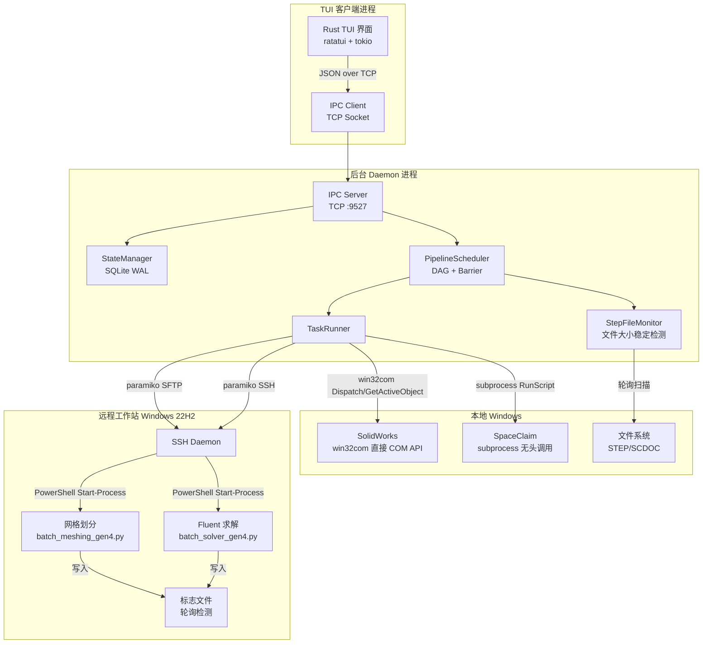

# 🚀 液氧甲烷火箭发动机仿真总控程序

> **Pipeline Daemon Engine v2.4.0** — 全自动流水线式 CFD 仿真调度系统

---

## 目录

- [项目概述](#项目概述)
- [版本历史](#版本历史)
- [系统架构](#系统架构)
- [流水线工作流](#流水线工作流)
- [目录结构](#目录结构)
- [技术栈](#技术栈)
- [核心模块详解](#核心模块详解)
- [IPC 通信协议](#ipc-通信协议)
- [状态管理 (SQLite)](#状态管理-sqlite)
- [DAG 调度器设计](#dag-调度器设计)
- [快速开始](#快速开始)
- [配置说明](#配置说明)
- [TUI 界面操作指南](#tui-界面操作指南)
- [命令参考](#命令参考)
- [环境变量](#环境变量)
- [常见问题解答](#常见问题解答)
- [注意事项](#注意事项)

---

## 项目概述

本项目是一个**全自动化的火箭发动机仿真流水线控制系统**，用于批量执行液氧甲烷火箭发动机喷注器构型的 CFD（计算流体动力学）仿真。系统通过自动化串联 **SolidWorks 参数化建模 → SpaceClaim 几何转换 → 远程文件传输 → 网格划分 → Fluent 求解** 五个阶段，将原本需要人工逐一手动操作的上百个构型仿真任务变为全自动无人值守运行。

### 核心特性

- **全自动流水线**: 从 Excel 参数表读取上百组构型参数，自动完成从建模到求解的全流程
- **C/S 分离架构**: 后台守护进程 (Daemon) + 终端交互界面 (TUI)，可独立部署、独立重启
- **直接 COM API 导出**: 通过 win32com 直接调用 SolidWorks COM API 导出 STEP 文件，无需依赖宏文件 (`.swp`)
- **设计表多策略导入**: 支持 InsertFamilyTableOpen → COM 直接设参 三层降级策略，自动适配不同参数名匹配场景
- **持久化状态管理**: 基于 SQLite WAL 模式，支持断点续传，Daemon 重启不丢失进度
- **DAG 任务调度**: 实现 Producer-Consumer 异步队列 + 全局同步屏障（Barrier），边导出边处理的并行流水线
- **文件系统事件驱动**: 通过文件大小稳定检测判断 STEP 写入完成，实现步骤间自动衔接
- **远程任务编排**: 通过 SSH 远程控制 Windows 工作站，使用 PowerShell `Start-Process` 启动独立后台进程
- **递归深度安全限制**: 对 SW 宏自动重试设置递归上限（3层），超限时优雅降级并给出详细诊断
- **错误重试机制**: 每个步骤支持可配置的重试次数，SW 宏支持独立的重试策略，失败时自动清理残留进程
- **优雅关闭**: 支持 `Ctrl+C` 信号处理和 `quit full` 安全退出，自动断开 SSH、停止文件监控、关闭 SW 进程
- **配置预验证**: 启动时校验 Excel 设计表格式、本地文件路径、远程 SSH 连通性，提前发现部署问题

---

## 版本历史

| 版本 | 日期 | 主要变更 |
|------|------|----------|
| **v2.4.0** | 2026-05 | SpaceClaim 步骤全面修复：脚本路径重构并移至 executor/ 目录、修复参数传递与错误处理、新增并发进程清理逻辑防止冲突；注入调度器控制事件以支持长时间阻塞操作的暂停/停止响应；移除 chrono 依赖改用本地时间实现；Rust TUI 二进制查找工具重构 |
| **v2.3.0** | 2026-05 | TUI 交互体验优化：信息面板/详细日志面板智能自动滚动（新消息自动滚到底端、向上滚动暂停、滚回底端自动恢复）；详细日志每次单击高亮反馈；自检弹窗自动换行与对称边距；焦点提示信息统一 |
| **v2.2.0** | 2026-05 | 移除 Python Textual TUI，统一使用 Rust ratatui TUI；新增滚动条拖拽（垂直/水平）；信息面板和详细日志面板支持水平滚动；对话框支持内容滚动和鼠标按钮交互；双击详细日志行复制到剪贴板；Rust TUI 编译状态检查与友好错误提示；新增分布式架构改造路线图（ROADMAP.md） |
| **v2.1.0** | 2026-05 | 新增设计表自动检测与多策略导入（InsertFamilyTableOpen → COM 直接设参降级）；递归深度安全限制与优雅降级；Excel 设计表格式预验证；文件监控增强（SW 宏重试前重置监控状态）；TUI 新增 Daemon 启停控制按钮与增量表格更新；命令日志 IPC 通道 |
| **v2.0.0** | 2025-05 | 架构重写：SW 导出从宏文件驱动改为直接 COM API 调用；C/S 分离 IPC 架构；Rust TUI 界面（ratatui）；DAG 调度器与全局屏障；SQLite WAL 状态持久化；远程 SSH 后台任务编排 |
| **v1.0.0** | 2025-04 | 初始原型：基于 SolidWorks 宏文件 (`Macro1.swp`) 的 STEP 批量导出；基础流水线控制 |

---

## 系统架构



### 架构设计要点

| 组件 | 职责 | 技术选型 |
|------|------|----------|
| **PipelineDaemon** | 后台常驻进程，协调所有子系统 | Python 多线程 |
| **PipelineScheduler** | DAG 任务调度，全局屏障控制，SW 重试编排 | Producer-Consumer 队列 |
| **StateManager** | 持久化状态存储，支持并发读取，设计表同步 | SQLite (WAL mode) |
| **TaskRunner** | 执行各阶段具体操作，三层 SW 启动降级 | win32com / subprocess / paramiko |
| **StepFileMonitor** | 检测 SW 导出的 STEP 文件，文件大小稳定判定 | 轮询 + 历史采样 |
| **IPC Server/Client** | Daemon 与 TUI 间通信 | TCP Socket + JSON |
| **PipelineTUI** | 交互式终端界面，增量表格更新，滚动条拖拽，鼠标交互，剪贴板复制，智能自动滚动，自检弹窗自动换行 | Rust ratatui 框架 |

---

## 流水线工作流

每个构型按以下五阶段依次执行：


### 阶段详解

| 阶段 | 操作 | 输入 | 输出 | 执行方式 |
|------|------|------|------|----------|
| **SW** | 三层降级连接 SW → OpenDoc6 打开模型 → 设计表多策略导入 → ForceRebuildAll 重建 → 逐构型 ShowConfiguration2 + SaveAs 导出 STEP | `model_gen4.SLDPRT` + Excel 参数表 | `model_gen4.SLDPRT_{N}.step` | win32com 直接 COM API（不依赖宏文件） |
| **SC** | SpaceClaim 无头启动，运行脚本转换几何 | `.step` 文件 | `model_gen4_{N}.scdoc` | subprocess `/RunScript` 无头调用 |
| **Transfer** | 通过 SFTP 上传 scdoc 到远程工作站 | `.scdoc` 文件 | 远程 `.scdoc` | paramiko SFTP |
| **Meshing** | 远程启动网格划分后台进程，轮询标志文件等待完成 | 远程 `.scdoc` | `.msh.h5` + 标志文件 | SSH + PowerShell Start-Process |
| **Solver** | 全局屏障通过后，远程启动 Fluent 求解，轮询标志文件等待完成 | `.msh.h5` | `.cas.h5` + `.dat.h5` | SSH + PowerShell Start-Process |

### SW 阶段设计表导入策略

SW 阶段采用三层降级策略将 Excel 设计表参数应用到模型：

| 优先级 | 策略 | 说明 |
|--------|------|------|
| **0** | 设计表存在检测 | 若模型已有链接设计表（SW 打开时自动同步参数），跳过导入 |
| **1** | InsertFamilyTableOpen | SW 原生 API 导入 Excel 设计表（最可靠），含颜色/字体信息 |
| **2** | COM 直接设参 | 解析 Excel → 枚举配置 → 逐个 `doc.Parameter(name).Value` 设置，仅设匹配参数 |

全部策略失败时，系统会输出详细的参数名不匹配诊断报告，指导用户修正 Excel 或模型参数名。

### 调度策略

1. **SW 阶段**: 一次性遍历所有配置，逐构型切换并导出 STEP。文件监控器**在 SW 宏执行前提前启动**，实现边导出边处理的并行流水线
2. **SC → Transfer → Meshing**: 异步流水线，3 个工作线程并发处理，每个构型独立推进
3. **全局屏障 (Barrier)**: 屏障监控线程轮询所有构型的 Meshing 状态，全部 `Completed` 后统一解锁 Solver
4. **Solver 阶段**: 所有构型并行启动求解，独立线程运行

### 状态流转

```
Waiting → Running → Retrying → Completed
                  ↘ Error → (reset) → Waiting
                        ↘ Paused → (resume) → Running
```

---

## 目录结构

```
AutoFluidSimulation/
├── main.py                  # 总控程序入口（支持 --daemon / --client / --all）
├── start_daemon.py          # 后台 Daemon 启动脚本（推荐）
├── start_client.py          # TUI 客户端启动脚本（推荐）
├── rebuild_tui.bat          # Rust TUI 一键构建脚本（含选择性清理）
├── requirements.txt         # Python 依赖清单
├── README.md                # 本文件
├── CODE_WIKI.md             # 项目代码 Wiki 文档
├── ROADMAP.md               # 分布式架构改造路线图
├── .gitignore               # Git 忽略规则
│
├── engine/                  # 后台引擎模块
│   ├── config.py            # 全局配置中心（路径、SSH、IPC、引擎参数）
│   ├── daemon.py            # PipelineDaemon：后台守护进程主类
│   ├── scheduler.py         # PipelineScheduler：DAG 任务调度器
│   ├── task_runner.py       # TaskRunner：各阶段任务执行器
│   ├── state_manager.py     # StateManager：SQLite 共享状态管理器
│   └── file_monitor.py      # StepFileMonitor：STEP 文件监控与稳定检测
│
├── ipc/                     # 进程间通信模块
│   ├── protocol.py          # IPC 协议定义（命令常量、消息序列化）
│   └── server.py            # IPCServer：TCP Socket 命令服务器
│
├── executor/                # 外部执行器脚本
│   └── spaceclaim_transit.py # SpaceClaim 脚本：STEP → SCDOC 转换（V23 API）
│
├── utils/                   # 工具模块
│   ├── excel_reader.py      # Excel 构型参数读取（openpyxl）
│   ├── ssh_client.py        # RemoteWorkstation：SSH/SFTP 远程操作封装
│   ├── logger.py            # 统一日志工具
│   └── tui_launcher.py      # Rust TUI 二进制查找与启动（main.py/start_client.py 共用）
│
├── autofluid-tui/           # Rust TUI 客户端（唯一前端界面）
│   ├── Cargo.toml           # Rust 项目配置 & 依赖
│   └── src/
│       ├── main.rs          # 异步主循环 + 鼠标事件处理
│       ├── daemon_mgr.rs    # Daemon 进程管理器
│       ├── ipc/             # IPC 通信模块
│       ├── state/           # 应用状态模块
│       ├── event_handler/   # 事件处理模块
│       └── ui/              # UI 渲染模块（含 scrollbar.rs 滚动条组件）
│
├── tests/                   # 测试模块
│   ├── test_pause_start.py          # 暂停/启动功能测试
│   ├── test_sw_export_workflow.py   # SW 导出工作流测试
│   ├── test_sw_step_naming.py       # SW 步骤命名测试
│   └── test_detail_log.py          # 详细日志功能测试
│
```

---

## 技术栈

### 运行环境

| 类别 | 要求 |
|------|------|
| **操作系统** | Windows 10/11（本地） |
| **Python** | 3.10+ |
| **必备软件** | SolidWorks 2020+, ANSYS SpaceClaim 2023 R1, ANSYS Fluent 2023 R1 |

### Python 依赖

| 包 | 最低版本 | 用途 |
|----|----------|------|
| `openpyxl` | ≥3.1.0 | Excel 参数表读写与设计表格式预验证 |
| `python-dotenv` | ≥1.0.0 | `.env` 环境变量文件加载 |
| `pywin32` | ≥305 | SolidWorks COM 自动化接口 |
| `paramiko` | ≥3.0.0 | SSH/SFTP 远程工作站通信 |
| `watchdog` | ≥3.0.0 | 文件系统事件监控（可选，当前使用轮询模式） |

安装依赖：

```powershell
pip install -r requirements.txt
```

### 外部依赖

- **SolidWorks**: 需安装并注册 COM 接口，模型文件需位于指定路径。支持通过 `sw_exit_on_finish` 配置自动退出或保持运行
- **SpaceClaim**: 需安装 ANSYS SpaceClaim 2023 R1。转换脚本 `executor/spaceclaim_transit.py` 已集成在项目中（V23 API 兼容），通过 subprocess `/RunScript` + `/ScriptArgs` 无头调用
- **远程 Windows 工作站**: 需启用 OpenSSH Server，安装 ANSYS Fluent + pyfluent，配置 Conda 环境，建议配置 `conda_exe` 完整路径

---

## 核心模块详解

### 1. PipelineDaemon（[daemon.py](engine/daemon.py)）

后台守护进程主类，作为整个系统的中央协调器。启动时依次执行：
- 创建必要目录并验证配置完整性
- 从 Excel 加载构型数据并同步到状态库（增量同步：新增设计表构型、保留已有状态、删除过期构型）
- 启动 IPC 服务器监听 TUI 客户端连接
- 注册信号处理器（SIGINT/SIGTERM）实现优雅退出
- 进入主循环等待客户端指令

Daemon 负责处理所有 IPC 命令（start/pause/stop/check/reset/clean），每个命令通过独立回调函数处理，确保 IPC 响应不被阻塞。

### 2. PipelineScheduler（[scheduler.py](engine/scheduler.py)）

DAG 任务调度器，实现了完整的异步流水线调度逻辑：

- **SW 阶段编排**: 检查 `sw_macro_started` 标志 → 批量标记构型为 Running → 提前启动文件监控和工作线程池 → 执行 SW 宏（含 `sw_max_retries` 次重试）→ 失败时自动清理残留 SW 进程并重置监控状态
- **递归深度安全限制** (`_recursion_depth`): 当 SW 重试自动递归重入超过 3 层时，停止所有调度线程，将所有非终态 SW 步骤标记为 Error，输出详细诊断信息
- **Producer-Consumer 队列**: SW 导出后，文件监控器（Producer）推送构型到 `sc_queue`，3 个工作线程（Consumer）并发处理 SC → Transfer → Meshing
- **全局屏障**: 独立线程轮询所有构型的 Meshing 状态，全部 Completed 后解锁 Solver。若所有 Meshing 均为终态（Completed/Error）且有 Error，报告屏障失败
- **暂停/继续**: 设置 `threading.Event`，暂停时将 Running/Retrying 步骤批量切换为 Paused，恢复时反向操作。SW 宏（同步 COM 阻塞）不可中断，但完成后暂停生效

### 3. TaskRunner（[task_runner.py](engine/task_runner.py)）

任务执行器，封装了每个流水线步骤的具体操作：

- **SW 阶段**（[L864-L1242](engine/task_runner.py#L864-L1242)）:
  - 三层降级连接策略：`GetActiveObject` → `Dispatch` → `subprocess Popen` 直接启动 EXE
  - OpenDoc6 静默打开模型（抑制弹窗）
  - 设计表多策略导入（InsertFamilyTableOpen → COM 直接设参）
  - ForceRebuildAll 重建所有构型（降级为逐个 EditRebuild3）
  - 逐构型 `ShowConfiguration2` → `Extension.SaveAs` 导出 STEP
  - 完成后校验 STEP 文件完整性、关闭文档、退出 SW、释放 COM 资源、双重 CoFreeUnusedLibraries
  - 检查并处理可能出现的文件占用问题
- **SC 阶段**: subprocess 无头调用 SpaceClaim，格式严格为 `/RunScript="<脚本>" /ScriptArgs="<构型名>"`，含超时保护和输出验证
- **Transfer 阶段**: SFTP 上传 SCDOC，自动创建远程目录（递归 mkdir）
- **Meshing/Solver 阶段**: 通过 `RemoteWorkstation.exec_background()` 启动独立后台进程，轮询标志文件等待完成

### 4. StateManager（[state_manager.py](engine/state_manager.py)）

基于 SQLite WAL 模式的持久化状态管理器，核心设计：
- **WAL 模式**: 允许多个读进程（TUI）与一个写进程（Daemon）并发访问
- **线程安全**: `threading.Lock` 串行化写操作，`contextmanager` 自动提交/回滚
- **设计表同步**: `load_configs()` 实现增量同步——新增设计表中的构型、保留已有构型状态、删除设计表中已移除的构型
- **批量操作**: `reset_all()` / `set_all_running_to_paused()` / `set_all_paused_to_running()` 等高效批量状态切换
- 数据库文件路径：`{data_dir}/pipeline_state.db`

### 5. StepFileMonitor（[file_monitor.py](engine/file_monitor.py)）

STEP 文件监控器，通过轮询和文件大小采样检测文件写入完成：
- **FileStableDetector**: 2 秒内文件大小不变即判定写入完成；超过 6 秒未稳定则放弃监控并告警
- **自动识别**: 通过正则匹配 `model_gen4.SLDPRT_{N}.step` 文件名解析构型号
- **断点续传**: 启动时扫描已存在的 STEP 文件，加入 `known_files` 集合
- **可重置状态**: SW 宏重试前清空 `processed_files`、`known_files`、`detector._history` 等集合，避免重试时同名文件被跳过

---

## IPC 通信协议

### 协议概述

TUI 客户端与 Daemon 之间通过 **TCP Socket (127.0.0.1:9527)** 通信，使用 **JSON 文本协议**（每条消息以 `\n` 结尾）。每个客户端连接在独立线程中处理，支持连接断开后重新连接。

### 请求格式

```json
{
    "command": "start",
    "params": {
        "config_name": 1,
        "step_name": "SW"
    },
    "request_id": "a1b2c3d4"
}
```

### 响应格式

```json
{
    "status": "ok",
    "data": { ... },
    "message": "流水线已启动",
    "request_id": "a1b2c3d4"
}
```

### 命令列表

| 命令 | 常量 | 说明 |
|------|------|------|
| `start` | `CMD_START` | 启动/继续流水线（含状态不一致自动修正） |
| `pause` | `CMD_PAUSE` | 暂停流水线 |
| `stop` | `CMD_STOP` | 完全停止引擎 (quit full) |
| `check` | `CMD_CHECK` | 系统自检（本地路径 + SSH 连通性 + 远程进程） |
| `get_all_status` | `CMD_GET_ALL_STATUS` | 获取所有构型状态 |
| `get_statistics` | `CMD_GET_STATISTICS` | 获取统计信息（含引擎状态、屏障状态） |
| `get_engine_status` | `CMD_GET_ENGINE_STATUS` | 获取引擎运行状态 |
| `reset_step` | `CMD_RESET_STEP` | 重置构型步骤（支持 all 参数） |
| `clean_step` | `CMD_CLEAN_STEP` | 清理步骤文件（支持 all 参数，远程步骤自动后台执行） |

---

## 状态管理 (SQLite)

### 数据库表结构

```sql
-- 构型参数表
CREATE TABLE configs (
    config_name INTEGER PRIMARY KEY,  -- 构型编号
    param1 REAL NOT NULL,             -- 参数 1
    param2 REAL NOT NULL,             -- 参数 2
    param3 REAL NOT NULL,             -- 参数 3
    param4 REAL NOT NULL              -- 参数 4
);

-- 步骤状态表
CREATE TABLE steps (
    id INTEGER PRIMARY KEY AUTOINCREMENT,
    config_name INTEGER NOT NULL,     -- 所属构型
    step_name TEXT NOT NULL,          -- 步骤名称 (SW/SC/Transfer/Meshing/Solver)
    status TEXT NOT NULL DEFAULT 'Waiting',  -- 状态
    retry_count INTEGER NOT NULL DEFAULT 0,  -- 重试次数
    error_message TEXT DEFAULT '',    -- 错误信息
    updated_at REAL NOT NULL,         -- 更新时间戳
    UNIQUE(config_name, step_name),
    FOREIGN KEY(config_name) REFERENCES configs(config_name)
);

-- 引擎状态表（键值对存储）
CREATE TABLE engine_state (
    key TEXT PRIMARY KEY,
    value TEXT NOT NULL
);
```

引擎状态键说明：

| 键 | 默认值 | 说明 |
|----|--------|------|
| `engine_status` | `stopped` | 引擎状态：stopped / running / paused |
| `sw_macro_started` | `false` | SW 导出是否已完成 |
| `global_barrier_met` | `false` | 全局屏障是否已通过 |
| `error_count` | `0` | 错误累计计数 |

### 并发控制

- **WAL 模式**: 允许多个读进程（TUI）与一个写进程（Daemon）并发访问
- **线程锁**: Daemon 内使用 `threading.Lock` 串行化写操作
- **断点续传**: 状态持久化在磁盘 `{data_dir}/pipeline_state.db`，Daemon 重启自动恢复
- **设计表同步**: `load_configs()` 实现增量同步——新增设计表中的构型（状态 Waiting）、保留已有构型状态（断点续传）、删除设计表中已移除的构型

---

## DAG 调度器设计

### Producer-Consumer 模型

```
┌─────────────┐     STEP 文件事件      ┌──────────────┐
│  SW 直接COM  │ ────────────────────→  │ FileMonitor  │
│  导出循环    │                        │ (Producer)   │
└─────────────┘                        └──────┬───────┘
                                              │ 推送构型名称
                                              ▼
                                     ┌────────────────┐
                                     │   sc_queue     │
                                     │   (Queue)      │
                                     └──────┬─────────┘
                                              │ 取出构型
                              ┌───────────────┼───────────────┐
                              ▼               ▼               ▼
                         ┌─────────┐   ┌─────────┐   ┌─────────┐
                         │Worker 1 │   │Worker 2 │   │Worker 3 │
                         │SC→Trans │   │SC→Trans │   │SC→Trans │
                         │ →Mesh   │   │ →Mesh   │   │ →Mesh   │
                         └─────────┘   └─────────┘   └─────────┘
```

关键特性：文件监控器在 SW 导出前提前启动，实现**边导出边处理**的并行流水线，而非等待全部导出完成后再批量处理。

### 全局同步屏障 (Barrier)

```
所有构型的 Meshing 阶段
        │
        ▼
┌───────────────────┐
│  屏障检测线程      │  ← 5 秒间隔轮询所有构型的 Meshing 状态
│  (Barrier Monitor) │
└────────┬──────────┘
         │ 所有 Meshing == Completed ?
         ▼
    ┌─────────┐
    │  YES    │ ───→ Solver Dispatcher 统一启动所有求解（并行独立线程）
    └─────────┘
    ┌─────────┐
    │  NO     │ ───→ 继续等待（检查是否有不可恢复的失败）
    └─────────┘
```

屏障失败条件：
- 所有 Meshing 均为终态（Completed/Error）且至少有一个 Error → 报告屏障失败，停止调度
- 所有 SW 均为 Error 且无 Completed → 提前检测、阻断后续步骤

### 暂停/继续机制

- `pause` 设置 `threading.Event`，将 Running/Retrying 步骤批量切换为 Paused
- 当前正在运行的步骤不会被中断（保证原子性），完成后不取新任务
- `start`（恢复）将所有 Paused 步骤恢复为 Running，清除 Event，检查并初始化下游组件
- SW 宏（同步 COM 阻塞调用）无法被 pause 中断，但宏执行完成后立即暂停

---

## 快速开始

### 前置条件

1. 确保 SolidWorks 2020+ 已安装，COM 接口可用（可通过 `win32com.client.Dispatch("SldWorks.Application")` 验证）
2. 确保 ANSYS SpaceClaim 2023 R1 已安装在默认路径
3. 确保远程 Windows 工作站已启用 OpenSSH Server，且允许密码登录
4. 确保远程工作站已安装 ANSYS Fluent + Conda 环境 `pyfluent`，并配置 `conda_exe` 完整路径
5. 将 Excel 参数表 `model_gen4.xlsx` 和 SolidWorks 模型 `model_gen4.SLDPRT` 放置在指定目录
6. 安装 Python 依赖：`pip install -r requirements.txt`
7. （可选）复制 `.env.example` 为 `.env` 并填写 SSH 密码等敏感信息

### 启动方式（推荐：双终端模式）

**终端 1** — 启动后台守护进程：

```powershell
python start_daemon.py
```

输出示例：

```
============================================================
  液氧甲烷火箭发动机仿真 - 后台调度引擎
  Pipeline Daemon Engine v2.4.0
============================================================

启动后将监听 IPC 连接，等待 TUI 客户端...
按 Ctrl+C 安全退出
```

**终端 2** — 启动 TUI 客户端：

```powershell
python start_client.py
```

### 快捷启动：TUI 内一键启动 Daemon

也可以先启动 TUI，然后通过界面按钮或命令启动 Daemon：

```powershell
python start_client.py
# 进入 TUI 后，点击 "Daemon Start" 按钮或输入 daemon start
```

### 其他启动方式

```powershell
# 仅启动 Daemon
python main.py --daemon

# 仅启动 TUI 客户端（前提：Daemon 已运行）
python main.py --client

# 同时启动（不推荐生产使用：Daemon 在后台线程中运行）
python main.py --all
```

---

## 配置说明

所有路径和参数在 [engine/config.py](engine/config.py) 中集中管理。

### 本地路径配置

```python
LOCAL_PATHS = {
    "sw_exe": r"C:\...\SLDWORKS.exe",              # SolidWorks 可执行文件（subprocess 备选启动）
    "sw_model": r"C:\...\model_gen4.SLDPRT",      # SolidWorks 初始模型
    "excel": r"C:\...\model_gen4.xlsx",            # Excel 参数表（唯一数据源）
    "step_dir": r"C:\...\step",                    # STEP 输出目录
    "sc_exe": r"C:\Program Files\ANSYS Inc\v231\SCDM\SpaceClaim.exe",
    "sc_script": r".\executor\spaceclaim_transit.py",  # SC 脚本（项目内 executor/ 目录）
    "scdoc_dir": r"C:\...\scdoc",                  # SCDOC 输出目录
    "log_dir": r".\logs",                          # 日志目录
    "data_dir": r".\data",                         # 数据库目录（独立于日志目录）
}
```

### 远程工作站配置

```python
REMOTE_CONFIG = {
    "host": "172.17.135.240",       # 远程工作站 IP
    "port": 22,                     # SSH 端口
    "username": "ps",               # SSH 用户名
    "password": "",                 # SSH 密码（通过环境变量或 .env 文件设置）
    "root_dir": r"D:\xkz_1020",     # 远程工程根目录
    "scdoc_dir": r"D:\xkz_1020\scdoc",
    "msh_dir": r"D:\xkz_1020\msh",
    "result_dir": r"D:\xkz_1020\case",
    "conda_env": "pyfluent",        # Conda 环境名
    "conda_exe": r"C:\ProgramData\anaconda3\Scripts\conda.exe",  # Conda 完整路径（必需！SSH 非交互会话 PATH 不含 conda）
    "meshing_script": r"D:\xkz_1020\batch_meshing_gen4.py",
    "solver_script": r"D:\xkz_1020\batch_solver_gen4.py",
    "flag_dir": r"D:\xkz_1020\flags",
}
```

### 引擎参数

```python
ENGINE_CONFIG = {
    "watchdog_interval": 1.0,       # 文件监控轮询间隔（秒）
    "sw_macro_timeout": 3600,       # SW 导出超时（秒）
    "sw_close_doc_on_finish": True, # 导出完成后关闭模型文档
    "sw_exit_on_finish": True,      # 导出完成后退出 SolidWorks
    "sw_visible": True,             # 是否显示 SolidWorks 主窗口
    "sw_max_retries": 2,            # SW 宏独立重试次数（默认 2，含首次共 3 次）
    "sc_timeout": 300,              # SC 脚本超时（秒）
    "transfer_timeout": 120,        # 文件传输超时（秒）
    "meshing_timeout": 600,         # 网格划分超时（秒）
    "solver_timeout": 7200,         # 求解超时（秒）
    "max_retries": 3,               # 下游步骤最大重试次数
    "state_refresh_interval": 0.5,  # TUI 状态刷新间隔（秒）
}
```

---

## TUI 界面操作指南

### 界面布局

```
┌──────────────────────────────────────────────────┐
│  🚀 液氧甲烷火箭发动机仿真总控程序 v2.4.0         │  ← 标题栏
│  引擎: 运行中  |  构型数: 12  |  屏障: 未通过      │  ← 信息栏
├──────────────────────────────────────────────────┤
│  构型  │ SW导出  │ SC转换  │ 文件传输│ 网格划分│ 仿真求解│  ← 状态表格
│  ──────┼─────────┼─────────┼─────────┼─────────┼─────────│
│    1   │  ✓      │  ✓      │  ✓      │  ⏳     │  ⏸     │
│    2   │  ✓      │  🔄     │  ⏸     │  ⏸     │  ⏸     │
│    3   │  ✓      │  ✓      │  ✓      │  ✓      │  ⏸     │
│   ...  │  ...    │  ...    │  ...    │  ...    │  ...    │
├──────────────────────────────────────────────────┤
│  [消息日志]                                      │  ← 日志面板（含自动滚动状态指示）
├──────────────────────────────────────────────────┤
│  > _                                              │  ← 命令输入
│  [Start] [Pause] [Check] [Status] ...  [Quit Full]│  ← 快捷按钮
└──────────────────────────────────────────────────┘
```

### 状态图标

| 图标 | 状态 | 颜色 | 含义 |
|------|------|------|------|
| ✓ | Completed | 绿色 | 该步骤已成功完成 |
| ⏳ | Running | 黄色闪烁 | 该步骤正在执行中 |
| 🔄 | Retrying | 橙色 | 该步骤正在重试中 |
| ⏸ | Waiting | 灰色 | 该步骤等待前置步骤完成 |
| ✗ | Error | 红色 | 该步骤执行出错 |
| ⏸ | Paused | 灰色 | 用户手动暂停（恢复后继续） |

### 快捷按钮

| 按钮 | 功能 | 说明 |
|------|------|------|
| **Start** | `start` | 启动或继续流水线 |
| **Pause** | `pause` | 暂停流水线 |
| **Check** | `check` | 系统自检（本地 + 远程） |
| **Status** | `status` | 显示统计摘要 |
| **Daemon Start** | `daemon start` | 在 TUI 内启动后台引擎并自动连接 |
| **Daemon Stop** | `daemon stop` | 停止后台引擎（TUI 继续运行） |
| **Quit** | `quit` | 退出 TUI（Daemon 继续运行） |
| **Quit Full** | `quit full` | 完全停止引擎 + 关闭 TUI |

### 快捷键

| 快捷键 | 功能 |
|--------|------|
| `Ctrl+C` | 退出 TUI（仅退出界面，Daemon 继续运行） |
| `Ctrl+Q` | 同上 |
| `Y` | 确认对话框 |
| `N` / `Esc` | 取消对话框 |

---

## 命令参考

### TUI 命令

| 命令 | 功能 | 示例 |
|------|------|------|
| `help` | 显示帮助信息 | `help` |
| `start` | 启动或继续流水线 | `start` |
| `pause` | 暂停流水线 | `pause` |
| `check` | 系统自检（弹窗显示结果） | `check` |
| `status` | 显示统计信息 | `status` |
| `reset <构型\|all> <步骤\|all>` | 重置构型步骤状态（需确认） | `reset 5 SW`、`reset all all` |
| `clean <构型\|all> <步骤\|all>` | 清理输出文件（需确认，显示影响目录） | `clean 5 SW`、`clean all all` |
| `daemon start` | 从 TUI 启动后台引擎并自动连接 | `daemon start` |
| `daemon stop` | 停止后台引擎（TUI 继续运行） | `daemon stop` |
| `quit` | 退出 TUI（Daemon 继续运行） | `quit` |
| `quit full` | 完全停止后台引擎并退出 | `quit full` |

### reset 命令说明

- `reset 5 SW` — 重置构型 5 的 SW 阶段及所有后续步骤为 Waiting，清除 `sw_macro_started` 标志
- `reset 5 SC` — 重置构型 5 的 SC 阶段及后续步骤，若重置触及 Meshing 则清除屏障状态
- `reset 5 all` — 重置构型 5 的所有步骤
- `reset all SW` — 重置所有构型的 SW 步骤
- `reset all all` — 重置所有构型的所有步骤，并清除全局屏障状态

### clean 命令说明

- `clean 5 SW` — 清理构型 5 的 STEP 文件
- `clean 5 all` — 清理构型 5 的所有本地和远程输出文件
- `clean all SW` — 清理所有构型的 STEP 文件
- `clean all all` — 清理所有构型的所有文件（本地 STEP/SCDOC + 远程 MSH/CAS/DAT），对话框会列出受影响的目录

---

## 环境变量

本项目支持通过环境变量覆盖关键配置（便于部署/迁移，无需修改源码）。未设置时回退到 [engine/config.py](engine/config.py) 内的默认值。

### 本地路径相关

| 变量名 | 对应配置 | 说明 |
|--------|----------|------|
| `AUTOFLUID_SW_EXE` | `LOCAL_PATHS["sw_exe"]` | SolidWorks 可执行文件路径 |
| `AUTOFLUID_SW_MODEL` | `LOCAL_PATHS["sw_model"]` | SW 初始模型文件路径 |
| `AUTOFLUID_SW_EXCEL` | `LOCAL_PATHS["excel"]` | Excel 参数表路径 |
| `AUTOFLUID_SW_MACRO` | `LOCAL_PATHS["sw_macro"]` | SW 宏文件路径（已弃用） |
| `AUTOFLUID_STEP_DIR` | `LOCAL_PATHS["step_dir"]` | STEP 文件输出目录 |
| `AUTOFLUID_SC_EXE` | `LOCAL_PATHS["sc_exe"]` | SpaceClaim 可执行文件路径 |
| `AUTOFLUID_SC_SCRIPT` | `LOCAL_PATHS["sc_script"]` | SC 脚本文件路径 |
| `AUTOFLUID_SCDOC_DIR` | `LOCAL_PATHS["scdoc_dir"]` | SCDOC 文件输出目录 |
| `AUTOFLUID_LOG_DIR` | `LOCAL_PATHS["log_dir"]` | 日志目录 |
| `AUTOFLUID_DATA_DIR` | `LOCAL_PATHS["data_dir"]` | 数据库目录 |

### SSH 连接相关

| 变量名 | 对应配置 | 默认值 |
|--------|----------|--------|
| `AUTOFLUID_SSH_HOST` | `REMOTE_CONFIG["host"]` | `172.17.135.240` |
| `AUTOFLUID_SSH_PORT` | `REMOTE_CONFIG["port"]` | `22` |
| `AUTOFLUID_SSH_USER` | `REMOTE_CONFIG["username"]` | `ps` |
| `AUTOFLUID_SSH_PASSWORD` | `REMOTE_CONFIG["password"]` | 空（需手动设置） |

**设置环境变量示例**（PowerShell）：

```powershell
$env:AUTOFLUID_SSH_PASSWORD = "your_password"
```

**推荐方式**：创建 `.env` 文件放置在项目根目录（已在 `.gitignore` 中排除）：

```
AUTOFLUID_SSH_PASSWORD=your_password
```

---

## 常见问题解答

### Q1: 启动 Daemon 时提示 "IPC 服务器启动失败（端口可能被占用）"

**原因**: 9527 端口已被另一个 Daemon 实例占用，或上次 Daemon 未正常退出导致端口未释放。

**解决**:
1. 检查是否有残留的 Python 进程：`tasklist | findstr python`
2. 若确认无其他 Daemon 运行，可尝试重启终端或更换端口（修改 [config.py](engine/config.py) 中的 `IPC_CONFIG["port"]`）
3. 正常情况下通过 `quit full` 命令退出可避免此问题

### Q2: SW 导出时提示 "设计表导入失败" 或参数名不匹配

**原因**: Excel 第 2 行的参数名（如 `$PRP@Dimension1`）与 SW 模型中的实际参数名不一致。

**解决**:
1. 查看 Daemon 日志输出的诊断报告——系统会自动列出不匹配的参数名
2. 若模型已有链接设计表（SW 打开时自动同步参数），系统会自动检测并跳过导入
3. 若 InsertFamilyTableOpen 失败，系统会自动降级为 COM 直接设参（仅设置匹配的参数）
4. 更新 Excel 第 2 行参数名使其与模型完全一致，或在 SW 中重命名模型参数

### Q3: SW 宏重试多次后仍失败，如何排查？

**原因**: 可能的原因包括：模型文件损坏、设计表参数格式错误、COM 通信故障、SW 进程残留。

**解决**:
1. 查看日志中 `_recursion_depth` 相关的详细诊断信息
2. 系统会自动将失败构型的 SW 步骤标记为 Error，并阻断下游步骤
3. 使用 `check` 命令执行系统自检，确认 SW 模型和 Excel 可访问
4. 手动运行一次 SW，确认模型文件可正常打开
5. 使用 `reset all all` 重置所有状态后重新 `start`

### Q4: TUI 断开后如何重新连接？

**原因**: TUI 客户端与 Daemon 是独立进程，TUI 退出不影响 Daemon 运行。

**解决**: 直接运行 `python start_client.py` 即可重新连接，所有状态和进度保持不变。

### Q5: 远程 SSH 连接失败

**原因**: 远程工作站未开启 OpenSSH Server、密码错误、网络不通、或 IP 变更。

**解决**:
1. 使用 `check` 命令查看 SSH 连接状态
2. 确认远程工作站 IP 可达：`ping 172.17.135.240`
3. 确认 OpenSSH Server 已启动：在远程工作站上运行 `Get-Service sshd`
4. 通过环境变量或 `.env` 文件设置正确的 `AUTOFLUID_SSH_PASSWORD`
5. 确认 `conda_exe` 路径在远程工作站上正确（SSH 非交互会话 PATH 不含用户级 conda）

### Q6: SpaceClaim 脚本执行超时

**原因**: SpaceClaim 脚本出错、STEP 文件损坏、或转换时间超过配置的超时值。

**解决**:
1. 检查 `LOCAL_PATHS["sc_exe"]` 和 `LOCAL_PATHS["sc_script"]` 路径是否正确
2. 检查对应的 STEP 输入文件是否存在
3. 手动运行一次 SpaceClaim 脚本验证是否可正常转换
4. 增大 `ENGINE_CONFIG["sc_timeout"]`（默认 300 秒）

### Q7: 如何验证设计表是否成功导入？

**方法**:
1. 观察 Daemon 终端日志中的 `[设计表]` 前缀消息
2. 使用 SQLite 工具查看 `pipeline_state.db` 中的 `steps` 表
3. 在 TUI 界面上观察 SW 步骤的状态图标变化（Running → Completed/Error）
4. 检查 STEP 输出目录中是否生成了对应的 `.step` 文件

---

## 注意事项

### 运行前提

1. **SolidWorks 必须已安装并注册 COM 接口**。程序支持三种启动方式：`GetActiveObject`（连接已有实例）→ `Dispatch`（COM 启动新实例）→ `subprocess Popen`（直接启动 EXE），依次降级
2. **SpaceClaim 转换脚本已集成**在 `executor/spaceclaim_transit.py`（V23 API 兼容），无需额外编写。脚本通过 subprocess `/RunScript` 无头调用，接收三个 `/ScriptArgs` 参数（构型名, STEP目录, SCDOC目录）
3. **远程工作站必须开启 OpenSSH Server**，且允许密码登录。`conda_exe` 需使用完整路径（SSH 非交互会话 PATH 不含用户级路径）
4. **Excel 参数表格式**: 第 1 行为设计表头（含 "Design Table"），第 2 行为参数列头（如 `$PRP@Dimension`），第 3 行起为数据行（构型名 + 4 个参数）。系统启动时会自动进行格式预验证
5. **网络连通性**: 本地需能 ping 通远程工作站 IP

### 最佳实践

- **生产环境推荐使用双终端模式**（`start_daemon.py` + `start_client.py`），便于观察日志和独立重启
- **首次运行前先执行 `check` 命令**进行系统自检，确认所有依赖就绪
- **定期检查日志文件**（位于 `LOCAL_PATHS["log_dir"]` 目录），排查异常
- **不要在生产环境随意使用 `reset all all` 或 `clean all all`**，除非确认需要完全重置；系统会在对话框中要求确认
- **SQLite 数据库文件** (`pipeline_state.db`) 位于 `data_dir`，可用任何 SQLite 工具直接查询状态
- **使用 `.env` 文件而非硬编码**存储 SSH 密码等敏感信息
- **SW 导出期间避免手动操作 SolidWorks**，防止 COM 接口冲突

### 故障排查速查表

| 现象 | 可能原因 | 解决方式 |
|------|----------|----------|
| `[CONFIG WARNING]` 启动提示 | 路径配置错误或文件缺失 | 检查 [config.py](engine/config.py) 中的路径和环境变量 |
| IPC 连接失败 | Daemon 未启动或端口被占用 | 先启动 `start_daemon.py`，检查 9527 端口 |
| SW 导出失败（全部构型） | SolidWorks 未安装 / COM 注册问题 / 模型损坏 | `check` 命令排查，手动打开 SW 验证模型 |
| SW 导出失败（部分构型） | 特定构型重建失败 / 设计表参数错误 | 查看 Daemon 日志，检查失败构型的参数值 |
| SSH 连接失败 | 远程工作站未开启 SSH / 密码错误 / 网络不通 | 检查 IP、端口、用户名、密码，ping 测试 |
| SC 脚本超时 | SpaceClaim 脚本出错或路径问题 | 检查脚本文件（`.py`/`.scscript`）和输入 STEP 文件，确认 ScriptArgs 参数正确 |
| 网格划分/求解超时 | 远程任务执行异常或模型过大 | 增大超时配置，远程手动验证脚本 |
| `[队列异常]` 日志警告 | SW 完成的构型未正确入队 | 检查文件监控器状态，使用 `reset` 重新触发 |

### 开发相关

- 状态数据库路径：`{LOCAL_PATHS["data_dir"]}\pipeline_state.db`
- IPC 默认端口：`9527`
- 日志格式：`[时间] [级别] [模块名] 消息内容`
- TUI 界面使用 Rust ratatui 框架进行渲染
- 文件监控稳定检测参数：`stable_time=2.0s`，`check_interval=1.0s`

---

## 许可证

本项目用于学术研究（毕业设计），未经许可不得用于商业用途。

---

> **当前版本**: v2.4.0
> **开发周期**: 2025-04 — 2026-05
> **适用场景**: 液氧甲烷火箭发动机喷注器构型批量 CFD 仿真
