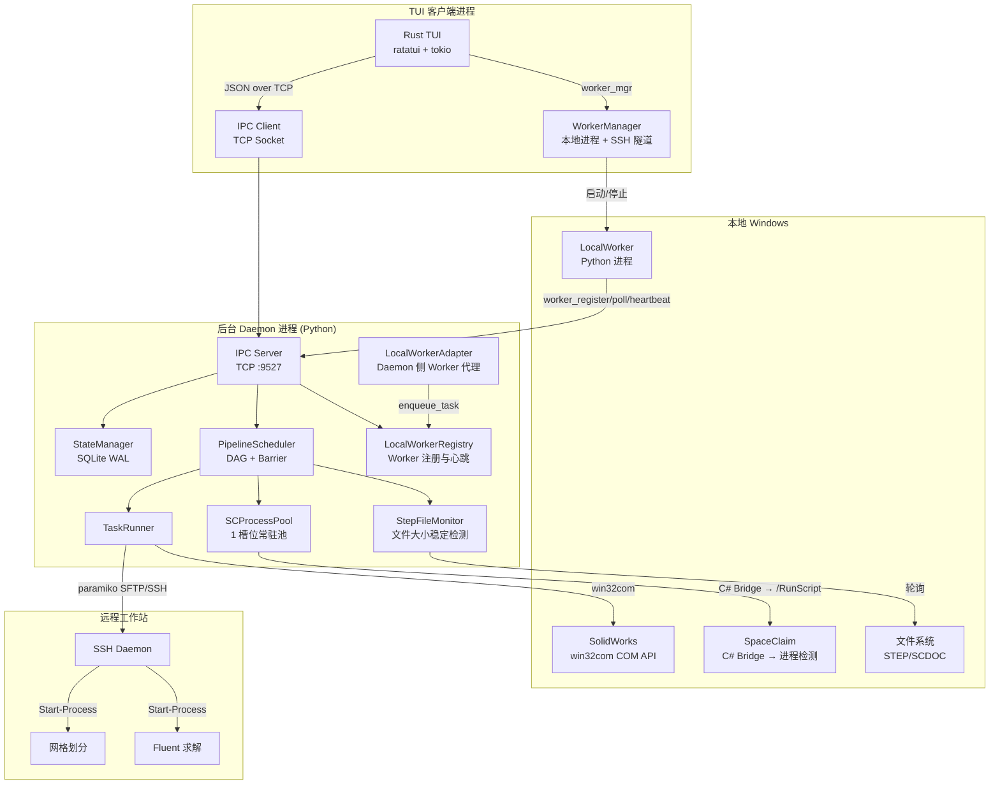

# 🚀 AutoFluid — 火箭发动机 CFD 仿真全自动流水线

> **Pipeline Daemon Engine v2.8.2** — Client/Server 分离架构的批量仿真调度系统

---

## 项目概述

AutoFluid 是一个**全自动 CFD 仿真流水线控制系统**，用于批量执行火箭发动机喷注器构型的计算流体动力学仿真。系统自动串联 **SolidWorks 参数化建模 → SpaceClaim 几何转换 → SFTP 远程传输 → 网格划分 → Fluent 求解** 五个阶段，将上百个构型的人工逐一操作变为无人值守全自动运行。

### 核心特性

- **全自动五阶段流水线**: 从 Excel 参数表读取构型，自动完成建模→转换→传输→网格→求解全流程
- **C/S 分离架构**: Python 后台守护进程 (Daemon) + Rust TUI 终端界面，独立部署、独立重启
- **直接 COM API**: 通过 `win32com` 直接调用 SolidWorks COM 接口导出 STEP，无需宏文件
- **TOML 配置体系**: 通过 `autofluid_config.toml` 集中管理所有路径和参数，TUI 内置可视化设置页面（9 分类 47 字段在线编辑）
- **SQLite WAL 持久化**: 状态实时落盘，支持断点续传，Daemon 重启不丢失进度
- **DAG 异步调度**: Producer-Consumer 队列 + 全局 Barrier，边导出边处理的并行流水线
- **SCProcessPool**: 1 槽位常驻进程池管理 SpaceClaim 并发调用（可通过 sc_max_slots 扩展），含等待队列与断点续传
- **C# Bridge**: SpaceClaim 通过 C# `SpaceClaimBridge.exe` 进程检测模式调用，三相 GUI 就绪检测
- **远程编排**: SSH + PowerShell `Start-Process` 在远程工作站启动独立后台进程
- **优雅关闭**: `quit full` 安全退出，自动断开 SSH、停止监控、清理残留进程
- **Worker 生命周期管理**: TUI 内 `worker start/stop/restart` 统一管理本地 Worker 进程和工作站 SSH 隧道

---

## 系统架构



| 组件                        | 职责                                        | 技术                             |
| --------------------------- | ------------------------------------------- | -------------------------------- |
| **PipelineDaemon**    | 后台常驻进程，协调所有子系统                | Python 多线程                    |
| **PipelineScheduler** | DAG 调度、Barrier 控制、SW 重试编排         | Producer-Consumer 队列           |
| **StateManager**      | 持久化状态，并发读写，增量同步              | SQLite WAL                       |
| **TaskRunner**        | 各阶段执行（SW/SC/Transfer/Meshing/Solver） | win32com / paramiko / subprocess |
| **SCProcessPool**     | SpaceClaim 1 槽位常驻池 + 等待队列          | C# Bridge 进程检测模式           |
| **StepFileMonitor**   | STEP 文件稳定性检测                         | 轮询 + 历史采样                  |
| **LocalWorkerRegistry** | Worker 注册、心跳、任务队列调度           | 内存注册表 + 线程锁              |
| **LocalWorkerAdapter** | Daemon 侧 Worker 代理，投递 SW/SC 任务    | enqueue/wait 模式                |
| **LocalWorker**       | 本地 Worker 客户端，执行 SW/SC 任务         | Python 进程 + IPC 轮询           |
| **WorkerManager**     | TUI 侧 Worker 进程和 SSH 隧道管理          | Rust 子进程管理                  |
| **IPC Server**        | Daemon ↔ TUI 通信                          | TCP + JSON                       |
| **PipelineTUI**       | 终端交互界面                                | Rust ratatui                     |

---

## 流水线工作流

```
SW 导出 → SC 转换 → Transfer 传输 → Meshing 网格 → Solver 求解
```

| 阶段               | 操作                                              | 输入                | 输出                      | 执行方式             |
| ------------------ | ------------------------------------------------- | ------------------- | ------------------------- | -------------------- |
| **SW**       | COM 连接 → 设计表导入 → 重建 → 逐构型导出 STEP | `.SLDPRT` + Excel | `.step`                 | win32com COM API     |
| **SC**       | C# Bridge 启动 SpaceClaim →`/RunScript` 转换   | `.step`           | `.scdoc`                | SCProcessPool 并发池 |
| **Transfer** | SFTP 上传                                         | `.scdoc`          | 远程 `.scdoc`           | paramiko SFTP        |
| **Meshing**  | 远程后台网格划分                                  | `.scdoc`          | `.msh.h5`               | SSH + PowerShell     |
| **Solver**   | Barrier 解锁后并行求解                            | `.msh.h5`         | `.cas.h5` + `.dat.h5` | SSH + PowerShell     |

### 调度策略

1. **SW 阶段**: 串行遍历所有构型，导出同时文件监控器并行推送下游
2. **SC → Transfer → Meshing**: SC + Transfer 各 1 个 Worker 线程组成流水线
3. **全局 Barrier**: 所有 Meshing 完成后统一解锁 Solver
4. **Solver 阶段**: 所有构型并行启动求解

### 状态流转

```
Waiting → Running → Retrying → Completed
                  ↘ Error → (reset) → Waiting
                       ↘ Paused → (resume) → Running
```

---

## 项目结构

```
AutoFluidSimulation/
├── main.py                  # 总控入口（--daemon / --client / --all）
├── start_daemon.py          # Daemon 启动脚本
├── start_client.py          # TUI 客户端启动脚本
├── rebuild.bat              # 全项目一键构建（Rust TUI + C# Bridge + 自动清理）
├── autofluid_config.toml    # TOML 配置文件（主配置源）
├── requirements.txt         # Python 依赖
│
├── engine/                  # 后台引擎
│   ├── config.py            # 配置中心（路径、SSH、引擎参数）
│   ├── config_fingerprint.py # 配置指纹（数据库分片）
│   ├── daemon.py            # PipelineDaemon 守护进程
│   ├── config_assigner.py    # ConfigAssigner 构型→工作站分配
│   ├── local_worker.py       # LocalWorker 本地 Worker 客户端
│   ├── local_worker_registry.py # LocalWorkerRegistry 注册与心跳
│   ├── local_worker_adapter.py  # LocalWorkerAdapter Daemon 侧代理
│   ├── scheduler/           # PipelineScheduler DAG 调度器（子包）
│   │   ├── main.py          # 调度主逻辑
│   │   ├── barrier.py       # 全局屏障协调器
│   │   ├── control.py       # 暂停/恢复/停止控制
│   │   ├── sw_phase.py      # SW 阶段处理器
│   │   ├── worker_pool.py   # Worker 线程池管理
│   │   ├── work_queue.py    # 工作队列
│   │   ├── meshing_monitor.py # 网格阶段监控
│   │   ├── retry.py         # 重试管理器
│   │   └── utils.py         # 调度工具函数
│   ├── task_runner.py       # TaskRunner 任务执行器
│   ├── state_manager.py     # StateManager SQLite 状态管理
│   ├── sc_process_pool.py   # SCProcessPool SpaceClaim 并发池
│   └── file_monitor.py      # StepFileMonitor 文件监控
│
├── ipc/                     # 进程间通信
│   ├── protocol.py          # IPC 协议（命令/消息）
│   └── server.py            # TCP Socket 服务器
│
├── executor/                # 外部执行脚本
│   ├── spaceclaim_transit.py # SC 转换脚本（V23 API）
│   ├── sw_executor.py        # SolidWorks COM 执行器
│   ├── remote_executor.py    # 远程 SSH 执行器
│   ├── cleaner.py            # 中间文件清理器
│   └── remote_scripts/       # 远程部署脚本
│
├── bridge/                  # C# SpaceClaim 桥接
│   └── SpaceClaimBridge/
│       ├── Program.cs       # 主程序（.NET 4.8，进程检测模式）
│       ├── Program.NoRef.cs # 免 ANSYS 引用版本
│       ├── compile.bat      # MSBuild 编译
│       ├── compile_noref.bat
│       └── find_msbuild.bat # MSBuild 自动探测
│
├── utils/                   # 工具模块
│   ├── excel_reader.py      # Excel 读取
│   ├── ssh_client.py        # SSH/SFTP 封装
│   ├── logger.py            # 日志工具
│   ├── process_utils.py     # 进程工具
│   └── tui_launcher.py      # TUI 二进制查找
│
├── autofluid-tui/           # Rust TUI 前端
│   ├── Cargo.toml
│   └── src/
│       ├── main.rs          # 二进制入口
│       ├── lib.rs           # 库入口（模块声明 + run_tui）
│       ├── daemon_mgr.rs    # Daemon 进程管理
│       ├── worker_mgr.rs    # Worker 进程管理（本地 Worker + SSH 隧道）
│       ├── event_handler.rs # 事件处理模块入口
│       ├── event_handler/   # 事件处理（command / key_handler / mouse / actions）
│       ├── ipc.rs           # IPC 通信模块入口
│       ├── ipc/             # IPC 通信（client.rs / protocol.rs）
│       ├── state.rs         # 应用状态模块入口
│       ├── state/           # 应用状态（app_state / filter / log_buffer）
│       ├── settings/        # 设置页面（9 分类 47 字段）
│       ├── text_buffer.rs   # 文本缓冲区
│       ├── theme.rs         # 主题配色
│       ├── ui.rs            # UI 渲染模块入口
│       ├── ui/              # UI 渲染（header / table / logs / dialogs / command_bar / scrollbar / layout）
│       └── utils.rs         # 工具函数
│
├── scripts/                 # 环境检查与部署脚本
│   ├── autofluid_env.ps1    # 环境变量加载库
│   ├── check_local_env.ps1  # 本地控制机环境检查
│   ├── check_remote_env.ps1 # 远程工作站环境检查（通过 SSH）
│   ├── setup_remote_workstation.ps1 # 远程工作站一键部署
│   ├── verify_remote_setup.ps1     # 远程环境快速验证
│   ├── start_autofluid_preflight.ps1 # 预检 + 启动 Daemon
│   ├── start_client_window.ps1     # TUI 客户端启动窗口
│   ├── start_daemon_window.ps1     # Daemon 启动窗口
│   ├── start_local_worker_window.ps1 # 本地 Worker 启动窗口
│   ├── start_server_ipc_tunnel.ps1 # 服务器 IPC 隧道
│   ├── start_workstation_reverse_tunnel.ps1 # 工作站反向 SSH 隧道
│   └── deploy_linux_server.sh # Linux 服务器部署脚本
│
├── tools/                   # 服务器 CLI 工具
│   └── autofluid_cli.py     # 服务器端命令行管理工具
│
├── docs/                    # 项目文档
│   ├── code-style-guide.md  # 代码规范
│   ├── architecture-refactoring-plan.md # 远期架构改进计划
│   ├── current-daemon-architecture.md # 当前 Daemon 架构说明
│   ├── solver-remaining-time-design.md # 求解器剩余时间估算
│   ├── test-failure-investigation-2026-06-17.md # 测试失败分析
│   ├── workstation-tunnel-recovery-plan.md # 工作站隧道自恢复方案
│   └── Fluent仿真数据采集与五项研究指标计算报告.md # 仿真数据采集报告
│
└── tests/                   # 测试（39 个测试文件）
```

---

## 技术栈

| 层                   | 技术                                                 |
| -------------------- | ---------------------------------------------------- |
| **后端**       | Python 3.10+                                         |
| **前端**       | Rust (ratatui 0.29 + tokio 1 + crossterm 0.28)       |
| **通信**       | TCP Socket + JSON (端口 9527)                        |
| **状态存储**   | SQLite WAL 模式                                      |
| **配置**       | TOML (`autofluid_config.toml`) + `.env` 敏感信息 |
| **C# Bridge**  | .NET Framework 4.8 / MSBuild                         |
| **COM 自动化** | pywin32 → SolidWorks COM API                        |
| **远程连接**   | paramiko SSH/SFTP                                    |
| **外部依赖**   | SolidWorks 2020+, SpaceClaim 2023 R1, Fluent 2023 R1 |

### Python 依赖

```
openpyxl≥3.1.0        # Excel 读写
python-dotenv≥1.0.0    # .env 加载
toml≥0.10.0            # TOML 配置
pywin32≥305            # SolidWorks COM
paramiko≥3.0.0         # SSH/SFTP
```

安装：`pip install -r requirements.txt`

---

## 快速开始

### 前置条件

> 以下所有条件必须在首次启动 AutoFluid 前满足。建议逐项检查，避免运行时出现难以排查的环境问题。

---

#### 1. 操作系统

| 要求                                                          | 说明                                                                                                                |
| ------------------------------------------------------------- | ------------------------------------------------------------------------------------------------------------------- |
| **Windows 10/11 x64** 或 **Windows Server 2019+** | 本地控制机与远程工作站均需 Windows。SolidWorks COM 自动化、.NET Framework 4.8、Rust Windows 目标均依赖 Windows 平台 |
| **管理员权限**（推荐）                                  | SolidWorks COM 注册、防火墙规则修改、SSH Server 安装可能需要管理员权限                                              |
| **PowerShell 5.1+**                                     | 远程任务通过 PowerShell `Start-Process` 启动，系统自带无需额外安装                                                |

---

#### 2. Python 运行环境

| 要求                         | 说明                                       |
| ---------------------------- | ------------------------------------------ |
| **Python 3.10+** | 推荐 3.13（项目 .venv 当前为 3.13.9） |
| **pip 23.0+**          | 用于安装依赖                               |

**依赖包清单**（`pip install -r requirements.txt` 一键安装）：

| 包名              | 最低版本 | 用途                                     |
| ----------------- | -------- | ---------------------------------------- |
| `openpyxl`      | ≥3.1.0  | 读取 Excel 参数表（`model_gen4.xlsx`） |
| `toml`          | ≥0.10.0 | TOML 配置文件解析（Python < 3.11 必需）  |
| `python-dotenv` | ≥1.0.0  | 加载 `.env` 敏感信息（SSH 密码等）     |
| `pywin32`       | ≥305    | SolidWorks COM 自动化接口                |
| `paramiko`      | ≥3.0.0  | SSH/SFTP 远程连接与文件传输              |
| `sqlite3`       | —       | Python 标准库自带，SQLite WAL 状态持久化 |

```powershell
# 创建虚拟环境（推荐）
python -m venv .venv
.venv\Scripts\activate

# 安装依赖
pip install -r requirements.txt
```

---

#### 3. Rust 编译工具链（编译 TUI 前端）

| 要求                                 | 说明                                          |
| ------------------------------------ | --------------------------------------------- |
| **Rust 稳定版**（MSVC 工具链） | 1.70+，推荐最新 stable                        |
| **Cargo**                      | 随 Rust 一起安装                              |
| **Windows MSVC Build Tools**   | Visual Studio 2022 生成工具（含 Windows SDK） |

**安装方式**：

```powershell
# 方式一：rustup 一键安装（推荐）
winget install Rustlang.Rustup
# 或访问 https://rustup.rs 下载安装器

# 方式二：如果已有 VS 2022，确认 MSVC 工具链
rustup default stable-msvc
rustup target add x86_64-pc-windows-msvc
```

**TUI 依赖的 Rust crate**（`cargo build` 自动拉取，无需手动安装）：

| Crate                      | 版本       | 用途                                       |
| -------------------------- | ---------- | ------------------------------------------ |
| `ratatui`                | 0.29       | 终端 UI 框架                               |
| `crossterm`              | 0.28       | 跨平台终端控制                             |
| `tokio`                  | 1          | 异步运行时（含 rt / net / io-util / time） |
| `serde` + `serde_json` | 1          | JSON 序列化（IPC 协议）                    |
| `toml`                   | 0.8        | TOML 配置解析                              |
| `clipboard-win`          | 5          | Windows 剪贴板访问                         |
| `windows-sys`            | 0.61       | Windows 系统 API（进程管理）               |
| `unicode-width`          | 0.2        | 中文字符宽度计算                           |
| `log` + `env_logger`   | 0.4 / 0.11 | 日志框架                                   |

---

#### 4. .NET Framework / C# 编译工具（编译 SpaceClaim Bridge）

| 要求                                                  | 说明                                           |
| ----------------------------------------------------- | ---------------------------------------------- |
| **.NET Framework 4.8 SDK**（含 Targeting Pack） | 编译 C# 桥接程序 `SpaceClaimBridge.exe`      |
| **MSBuild**（随 VS 或 Build Tools 安装）        | 命令行编译器，`rebuild.bat` 自动检测以下路径 |

MSBuild 自动检测路径（按优先级）：

- VS 2022 Community / Professional / Enterprise
- VS 2022 Build Tools
- VS 2019 Community / Professional / Build Tools

**安装方式**：

```powershell
# 安装 Visual Studio 2022 Community（免费）
winget install Microsoft.VisualStudio.2022.Community
# 安装时勾选：".NET Framework 4.8 目标包" + "MSBuild"

# 或仅安装 Build Tools（无 IDE，体积较小）
winget install Microsoft.VisualStudio.2022.BuildTools
```

> **注意**：`SpaceClaimBridge` 是 SDK 风格 `.csproj` 项目，目标框架 `net48`，平台 `x64`。如只需编译免 API 引用版本，运行 `compile_noref.bat` 即可，无需安装 SpaceClaim。

---

#### 5. SolidWorks（本地 CAD 建模）

| 要求                                 | 说明                                                                     |
| ------------------------------------ | ------------------------------------------------------------------------ |
| **SolidWorks 2020 或更高版本** | COM 自动化接口 `SldWorks.Application` 需注册                           |
| **SolidWorks API 类型库**      | 随 SolidWorks 安装，`pywin32` 通过 `win32com.client.Dispatch()` 调用 |
| **SW 模型及 Excel 参数表**     | `.SLDPRT` 文件 + 对应 `.xlsx` 设计表                                 |

**系统自检**（TUI 内执行 `check` 命令或手动验证）：

```powershell
# 验证 COM 注册
python -c "import win32com.client; sw = win32com.client.Dispatch('SldWorks.Application'); print(sw.RevisionNumber())"
```

**配置**（`autofluid_config.toml` → `[local_paths]`）：

- `sw_exe`: SolidWorks 可执行文件完整路径
- `sw_model`: `.SLDPRT` 模型文件路径
- `excel`: Excel 参数表路径
- `step_dir`: STEP 导出目录

---

#### 6. ANSYS SpaceClaim（本地几何转换）

| 要求                                              | 说明                                           |
| ------------------------------------------------- | ---------------------------------------------- |
| **ANSYS SpaceClaim 2023 R1 (v231)**         | 命令行模式 `/RunScript` 执行 Python 转换脚本 |
| **IronPython 解释器**（随 SpaceClaim 内置） | SpaceClaim 内嵌的脚本引擎，非系统 Python       |
| **SpaceClaim API V23 DLL**（可选）          | 仅强类型编译需要；纯进程检测模式无需此 DLL     |

**支持的版本**（`bridge/SpaceClaimBridge/Program.cs` 自动探测）：

- v231（2023 R1）
- v232（2023 R2）
- v241（2024 R1）

**配置**（`autofluid_config.toml` → `[local_paths]`）：

- `sc_exe`: `SpaceClaim.exe` 完整路径（如 `C:\Program Files\ANSYS Inc\v231\SCDM\SpaceClaim.exe`）
- `sc_script`: 转换脚本路径（`executor/spaceclaim_transit.py`）
- `sc_bridge`: C# 桥接程序路径（`bridge/SpaceClaimBridge.exe`）
- `scdoc_dir`: SCDOC 输出目录

---

#### 7. 远程工作站环境

| 要求                                                          | 说明                                                |
| ------------------------------------------------------------- | --------------------------------------------------- |
| **Windows 10/11 x64** 或 **Windows Server 2019+** | 远程计算节点，运行 Fluent 网格划分与求解            |
| **OpenSSH Server 已启用并运行**                         | 用于 SFTP 传输和远程命令执行                        |
| **网络连通**                                            | 本地与远程之间 TCP 22 端口可达，防火墙放行          |
| **Conda 环境 `pyfluent`**                             | 包含 PyFluent 的 Conda 虚拟环境，用于网格划分和求解 |
| **ANSYS Fluent 2023 R1+**                               | CFD 求解器，需通过 `pyfluent` Conda 环境调用      |

**远程 SSH 配置检查清单**：

```powershell
# 1. 远程：安装 OpenSSH Server
Add-WindowsCapability -Online -Name OpenSSH.Server~~~~0.0.1.0

# 2. 远程：启动并设为自动运行
Start-Service sshd
Set-Service -Name sshd -StartupType 'Automatic'

# 3. 远程：防火墙放行 22 端口
New-NetFirewallRule -Name 'OpenSSH-Server' -DisplayName 'OpenSSH Server' -Enabled True -Direction Inbound -Protocol TCP -Action Allow -LocalPort 22

# 4. 本地：测试 SSH 连接
ssh ps@172.17.135.240
```

**远程 Conda + Fluent 环境搭建**：

```powershell
# 安装 Anaconda / Miniconda
winget install Anaconda.Miniconda3

# 创建 pyfluent 环境并安装 PyFluent
conda create -n pyfluent python=3.10 -y
conda activate pyfluent
pip install ansys-fluent-core
```

**配置**（`autofluid_config.toml` → `[remote_config]`）：

- `host` / `port` / `username`: SSH 连接参数
- `conda_env` / `conda_exe`: Conda 环境名和可执行文件路径
- 远程目录映射：
  - `scripts_dir`: 远程脚本部署目录（.jou/.set/.wft/.py 上传目标）
  - `working_dir`: 仿真工作目录（动画输出前缀）
  - `scdoc_dir`: SCDOC 接收目录
  - `ref_files_dir`: 仿真引用文件目录（pdf/fla/chemkin 文件）
  - `msh_dir`: 网格输出目录
  - `result_dir`: 结果输出目录
  - `flag_dir`: 仿真标志目录

敏感信息通过项目根目录 `.env` 文件注入：

```
AUTOFLUID_SSH_PASSWORD=your_password
```

---

#### 8. 其他系统设置

| 设置项                        | 说明                                     |
| ----------------------------- | ---------------------------------------- |
| **PowerShell 执行策略** | 远程脚本调用需要 `RemoteSigned` 或更高 |

```powershell
# 本地和远程均需执行（管理员终端）
Set-ExecutionPolicy -ExecutionPolicy RemoteSigned -Scope CurrentUser
```

| **文件路径与权限** | 所有 `autofluid_config.toml` 中的目录需预先创建，程序不会自动创建顶层目录 |
| **防病毒软件** | 部分杀软可能拦截 `win32com` COM 调用或 TCP 127.0.0.1:9527 通信，如遇异常请添加白名单 |
| **端口 9527 可用** | Daemon ↔ TUI IPC 通信端口，确保未被其他程序占用 |

---

#### 环境自检速查表

| #  | 检查项              | 验证命令                                                                               |
| -- | ------------------- | -------------------------------------------------------------------------------------- |
| 1  | Python ≥ 3.10      | `python --version`                                                                   |
| 2  | pip 依赖完整        | `pip check`                                                                          |
| 3  | Rust 工具链         | `rustc --version` && `cargo --version`                                             |
| 4  | MSBuild 可用        | 运行 `rebuild.bat`（自动探测）                                                       |
| 5  | SolidWorks COM      | `python -c "from win32com.client import Dispatch; Dispatch('SldWorks.Application')"` |
| 6  | SpaceClaim 路径存在 | `Test-Path 'C:\Program Files\ANSYS Inc\v231\SCDM\SpaceClaim.exe'`                    |
| 7  | SSH 远程可达        | `ssh ps@<remote-host> "echo OK"`                                                     |
| 8  | 端口 9527 空闲      | `netstat -ano \| findstr :9527`（应为空）                                             |
| 9  | 目录结构就位        | 确认 `step_dir` / `scdoc_dir` / `.env` / `Excel` / `.SLDPRT` 均已存在        |
| 10 | TOML 配置正确       | TUI 启动后执行 `check` 命令或进入 `settings` 页面验证                              |

### 环境自动化脚本

`scripts/` 目录提供一套 PowerShell 脚本，用于快速检查和配置本地及远程环境：

| 脚本                               | 用途                                                        | 运行位置     |
| ---------------------------------- | ----------------------------------------------------------- | ------------ |
| `check_local_env.ps1`            | 逐项检查本地控制机环境（Python/Rust/MSBuild/SW/SC/SSH等）  | 本地控制机   |
| `check_remote_env.ps1`           | 通过 SSH 检查远程工作站环境（Conda/PyFluent/Fluent/MPI等） | 本地控制机   |
| `setup_remote_workstation.ps1`   | 一键部署远程工作站（SSH+Conda+PyFluent+目录结构）           | 远程工作站   |
| `verify_remote_setup.ps1`        | 在远程工作站本机快速验证环境就绪状态                        | 远程工作站   |
| `start_client_window.ps1`        | 设置窗口标题并启动 TUI 客户端                               | 本地控制机   |
| `start_daemon_window.ps1`        | 设置窗口标题并启动后台 Daemon                               | 本地控制机   |

```powershell
# 本地环境检查
.\scripts\check_local_env.ps1

# 远程环境检查（会提示输入 SSH 主机/用户）
.\scripts\check_remote_env.ps1

# 在远程工作站上（管理员身份）一键部署
.\scripts\setup_remote_workstation.ps1

# 在远程工作站上快速验证
.\scripts\verify_remote_setup.ps1
```

### 编译（首次使用）

```powershell
# 一键编译 Rust TUI + C# Bridge
rebuild.bat
```

### 启动

**推荐：双终端模式**

```powershell
# 终端 1 — 启动 Daemon
python start_daemon.py

# 终端 2 — 启动 TUI
python start_client.py
```

**TUI 内一键启动 Daemon**

```powershell
python start_client.py
# 进入 TUI 后点击 "😈 Daemon" 按钮 → 选择 "start" 或输入 daemon start
```

**其他方式**

```powershell
python main.py --daemon        # 仅 Daemon
python main.py --client        # 仅 TUI
python main.py --all           # 同时启动
```

---

## TUI 操作指南

### 界面布局

```
┌──────────────────────────────────────────────────────┐
│  🚀 液氧甲烷火箭发动机仿真总控程序           HH:MM:SS  │  ← 标题栏
├──────────────────────────────────────────────────────┤
│  引擎: 运行中  │  构型数: 72  │  屏障: 未通过          │  ← 信息栏
├──────────────────────────────────────────────────────┤
│  构型  │ SW导出   │ SC转换   │ 传输 │ 网格 │ 求解      │  ← 状态表格 (3/5 屏高)
│   1    │ ✅ ...  │ ⏳ ...  │ ...  │ ... │ ...       │
│  ...   │  ...    │  ...     │ ...  │ ... │ ...       │
├───────────────────────────┬──────────────────────────┤
│  📋 信息提示              │  📜 详细日志             │  ← 双栏日志 (2/5 屏高)
│  ✅ 流水线已启动           │  [INFO] 开始处理构型 1... │
│  ...                      │  [DEBUG] COM 调用...     │
├───────────────────────────┴──────────────────────────┤
│  > start                                          ▎ │  ← 命令输入行
|▶ Start│⏸ Pause│⚙ Settings│🔧 Check│...│👷 Worker│⏹ Full│  ← 快捷按钮栏
└──────────────────────────────────────────────────────┘
```

### 键盘快捷键

| 快捷键                  | 作用                                                          |
| ----------------------- | ------------------------------------------------------------- |
| `Tab`                 | 焦点区正向轮换：命令输入 → 状态表格 → 信息日志 → 详细日志  |
| `Shift+Tab`           | 焦点区反向轮换                                                |
| `Ctrl+C`                | 退出 TUI（后台引擎继续运行）                                  |
| `↑` `↓`           | 当前焦点区滚动（表格/日志行移动）                             |
| `PageUp` `PageDown` | 整页滚动（表格/日志 ±10 行）                                 |
| `Home`                | 跳转到顶部                                                    |
| `End`                 | 跳转到底部（日志区：启用自动跟随）                            |
| `Enter`               | 提交命令（焦点在命令输入时）；或激活输入（焦点在表格/日志时） |
| `Esc`                 | 关闭对话框 / 退出设置页面 / 取消编辑                          |

### 鼠标交互

| 操作                          | 说明                                                                         |
| ----------------------------- | ---------------------------------------------------------------------------- |
| **点击按钮**            | 触发对应命令（Start / Pause / Settings / Check / Status / Quit / Quit Full） |
| **点击 😈 Daemon 按钮** | 展开下拉菜单（start / stop / restart），再次点击选项执行                     |
| **点击 👷 Worker 按钮** | 展开下拉菜单（start / stop / restart），再次点击选项执行                     |
| **点击表格行**          | 高亮当前行                                                                   |
| **点击日志行**          | 高亮当前行                                                                   |
| **滚轮滚动**            | 在表格、信息日志、详细日志区域各自独立滚动                                   |
| **拖拽滚动条**          | 所有带滚动条区域均支持鼠标拖拽                                               |
| **双击设置字段**        | 快速进入编辑模式                                                             |
| **点击对话框按钮**      | 确认 / 取消 操作                                                             |

### 快捷按钮

| 按钮                   | 对应命令      | 说明                                                                |
| ---------------------- | ------------- | ------------------------------------------------------------------- |
| **▶ Start**     | `start`     | 启动/继续流水线                                                     |
| **⏸ Pause**     | `pause`     | 暂停流水线                                                          |
| **⚙ Settings**  | `settings`  | 可视化配置（9 分类 48 字段在线编辑）                                |
| **🔧 Check**     | `check`     | 系统自检（弹出结果对话框）                                          |
| **📊 Status**    | `status`    | 统计摘要（引擎状态/各步骤完成数）                                   |
| **😈 Daemon**    | 下拉菜单      | 展开子菜单：`daemon start` / `daemon stop` / `daemon restart` |
| **� Worker**    | 下拉菜单      | 展开子菜单：`worker start` / `worker stop` / `worker restart` |
| **�🚪 Quit**      | `quit`      | 退出 TUI（后台引擎继续运行）                                        |
| **⏹ Quit Full** | `quit full` | 完全退出（停止引擎 + 关闭 TUI，弹出确认对话框）                     |

### 完整命令列表

#### 流水线控制

| 命令                            | 说明                                     | 示例                                   |
| ------------------------------- | ---------------------------------------- | -------------------------------------- |
| `start`                       | 启动/继续流水线                          | `start`                              |
| `pause`                       | 暂停流水线                               | `pause`                              |
| `check`                       | 系统自检（本地路径 + 远程连通性）        | `check`                              |
| `status`                      | 显示引擎状态和各步骤统计摘要             | `status`                             |
| `reset <构型\|all> <步骤\|all>` | 重置构型步骤状态（弹出确认对话框）       | `reset 5 sw`、`reset all all`      |
| `clean <构型\|all> <步骤\|all>` | 清理步骤产生的中间文件（弹出确认对话框） | `clean 5 all`、`clean all meshing` |
| `settings`                    | 打开可视化设置页面                       | `settings`                           |

#### Daemon 生命周期

| 命令               | 说明                                              |
| ------------------ | ------------------------------------------------- |
| `daemon start`   | 启动后台引擎并自动建立 IPC 连接（最多等待 10 秒） |
| `daemon stop`    | 停止后台引擎（弹出确认对话框，TUI 继续运行）      |
| `daemon restart` | 重启后台引擎（先 stop 再 start，自动重连）        |

#### Worker 生命周期

| 命令                | 说明                                                         |
| ------------------- | ------------------------------------------------------------ |
| `worker start`    | 启动所有 Worker（建立 SSH 隧道 + 启动本地 Worker 进程）      |
| `worker stop`     | 停止所有 Worker（关闭进程和 SSH 隧道，弹出确认对话框）       |
| `worker restart`  | 重启所有 Worker（先 stop 再 start，弹出确认对话框）          |

#### 退出

| 命令          | 说明                                                              |
| ------------- | ----------------------------------------------------------------- |
| `quit`      | 退出 TUI，后台引擎继续运行（可通过 `start_client.py` 重新连接） |
| `quit full` | 完全退出：停止引擎 + 关闭 TUI（弹出确认对话框）                   |

#### 日志过滤

| 命令                 | 说明                                         |
| -------------------- | -------------------------------------------- |
| `filter debug`     | 仅显示 DEBUG 级别日志                        |
| `filter info`      | 仅显示 INFO 级别日志                         |
| `filter warning`   | 仅显示 WARNING 级别日志                      |
| `filter error`     | 仅显示 ERROR 级别日志                        |
| `filter critical`  | 仅显示 CRITICAL 级别日志                     |
| `filter remote`    | 仅显示远程命令执行日志（`remote_ps` 来源） |
| `filter local`     | 仅显示本地命令执行日志（`local_ps` 来源）  |
| `filter com`       | 仅显示 COM 自动化日志                        |
| `filter scheduler` | 仅显示调度器日志                             |
| `filter system`    | 仅显示系统日志                               |
| `filter ipc`       | 仅显示 IPC 通信日志                          |
| `filter clear`     | 清除过滤条件，显示全部日志                   |
| `filter status`    | 查看当前过滤状态                             |

#### 日志导出

| 命令                | 说明                                               |
| ------------------- | -------------------------------------------------- |
| `export`          | 导出当前日志到 `logs/export_YYYYMMDD_HHMMSS.log` |
| `export <文件名>` | 导出日志为指定文件名（自动追加 `.log` 后缀）     |

> **注意**：日志导出受当前 `filter` 影响——只导出符合过滤条件的条目。

#### 其他

| 命令     | 说明             |
| -------- | ---------------- |
| `help` | 显示完整帮助信息 |

### 状态图标

| 图标 | 状态                     | 含义              |
| ---- | ------------------------ | ----------------- |
| ✅   | `Completed`            | 已完成            |
| ⏳   | `Running`              | 执行中            |
| 🔄   | `Retrying`             | 重试中            |
| ⏸️ | `Waiting` / `Paused` | 等待执行 / 已暂停 |
| ❌   | `Error`                | 出错              |

### 设置页面（Settings）

输入 `settings` 或点击 **⚙ Settings** 按钮进入全屏设置对话框。共 **9 大分类 47 个字段**：

| 分类                     | 字段数 | 内容                                                                                    |
| ------------------------ | ------ | --------------------------------------------------------------------------------------- |
| **本地文件路径**   | 6      | SW/SpaceClaim 可执行文件、模型、Excel 参数表、STEP/SCDOC 输出目录                      |
| **远程工作站连接** | 4      | 主机地址、SSH 端口、用户名、密码（密码字段掩码显示，写入 `.env` 文件）                |
| **远程执行目录**   | 10     | 工作目录、脚本/引用文件目录、SCDOC/网格/结果/标志目录、Conda 环境名/路径、MPI 目录      |
| **步骤文件模板**   | 5      | SW / SC / Meshing / Solver / SolverData 各步骤输出文件命名模式（`{config}` 占位） |
| **SolidWorks**     | 5      | 宏超时、完成后关闭文档、显示窗口、启动超时、调度启动延迟                                |
| **SpaceClaim**     | 5      | 脚本超时、轮询间隔、进程出现等待、窗口就绪超时、窗口稳定等待                            |
| **网格划分**       | 2      | 网格超时、网格核心数                                                                    |
| **仿真求解**       | 3      | 求解超时、求解核心数、求解迭代次数                                                      |
| **全局设置**       | 7      | 看门狗间隔、状态刷新间隔、传输超时、SSH 连接/上传重试、最大重试、目录递归深度           |

**设置页面操作**：

| 操作           | 快捷键/方式                                         |
| -------------- | --------------------------------------------------- |
| 切换分类       | `Tab`（下一分类）/ `Shift+Tab`（上一分类）      |
| 切换字段       | `↑` `↓` 或鼠标滚轮                            |
| 编辑字段       | `Enter`（进入编辑模式）                           |
| 确认编辑       | `Enter`（提交修改）                               |
| 取消编辑       | `Esc`                                             |
| 光标移动       | `←` `→` / `Home` / `End`                  |
| 撤销修改       | `Ctrl+Z`（仅限本次编辑的字段，不可跨字段）        |
| 保存全部更改   | `Ctrl+S` 或点击 **保存更改** 按钮           |
| 放弃更改       | `Esc` 或点击 **取消** 按钮                  |
| 路径存在性检测 | 文件/目录路径字段自动展示 ✅（存在）或 ❌（不存在） |
| 字段校验       | 保存时自动校验（错误 ❌ 阻止保存，警告 ⚠ 可忽略）  |

---

## 配置说明

配置通过 `autofluid_config.toml` 集中管理，TUI 设置页面支持在线编辑。关键配置节：

| 配置节                   | 说明                                                        |
| ------------------------ | ----------------------------------------------------------- |
| `[local_paths]`        | 本地路径（SW/SC 可执行文件、模型、Excel、输出目录等）       |
| `[remote_config]`      | SSH 连接 + 远程目录和脚本路径                               |
| `[step_file_patterns]` | 各步骤输出文件命名模式                                      |
| `[solidworks]`         | SolidWorks 自动化参数（宏超时、窗口控制、启动延迟等）       |
| `[spaceclaim]`         | SpaceClaim 自动化参数（脚本超时、轮询间隔、GUI 就绪检测等） |
| `[meshing]`            | 网格划分参数（超时、处理器数）                               |
| `[solver]`             | 求解器参数（超时、处理器数、迭代数）                         |
| `[global_settings]`    | 全局引擎参数（看门狗、各阶段超时、重试、SSH 上传等）        |

> **向后兼容**：Python 侧硬编码默认值仍使用 `[engine_config]` 和 `[operation_timeouts]` 键名，TOML 中使用上述新键名即可覆盖。

敏感信息（SSH 密码）通过 `.env` 文件设置：

```
AUTOFLUID_SSH_PASSWORD=your_password
```

---

## IPC 协议

TUI ↔ Daemon 通过 TCP `127.0.0.1:9527` 通信，JSON 文本协议（`\n` 分隔）。

```json
// 请求
{"command": "start", "params": {}, "request_id": "a1b2c3d4"}

// 响应
{"status": "ok", "data": {}, "message": "流水线已启动", "request_id": "a1b2c3d4"}
```

| 命令                  | 说明                     |
| --------------------- | ------------------------ |
| `start`             | 启动/继续流水线          |
| `pause`             | 暂停流水线               |
| `stop`              | 完全停止引擎             |
| `check`             | 系统自检                 |
| `get_all_status`    | 获取所有构型状态         |
| `get_statistics`    | 获取统计信息             |
| `get_engine_status` | 获取引擎状态             |
| `get_log_entries`   | 增量拉取日志             |
| `get_dashboard`     | 批量获取状态+引擎+日志   |
| `reset_step`        | 重置步骤状态             |
| `clean_step`        | 清理步骤文件             |
| `reload_config`     | 重载 TOML 配置           |
| `worker_start`      | 启动所有 Worker          |
| `worker_stop`       | 停止所有 Worker          |
| `worker_restart`    | 重启所有 Worker          |
| `worker_register`   | LocalWorker 注册         |
| `worker_heartbeat`  | LocalWorker 心跳         |
| `worker_poll`       | LocalWorker 拉取任务     |
| `worker_step_complete` | LocalWorker 任务完成   |
| `worker_step_error` | LocalWorker 任务失败     |

---

## 构建

### 全项目构建

```powershell
rebuild.bat
```

三阶段流程：① 清理所有编译产物（Rust/C#/Python 缓存） → ② 编译 Rust TUI (`cargo build --release`) + C# Bridge (`MSBuild`) → ③ 清理中间产物，仅保留最终可执行文件。

### 单独构建 TUI

```powershell
cd autofluid-tui
cargo build --release
```

### 单独构建 Bridge

```powershell
cd bridge\SpaceClaimBridge
compile.bat          # 强类型版本（需 SpaceClaim API DLL）
compile_noref.bat    # 免引用版本
```

---

## 常见问题

### IPC 端口被占用

`quit full` 正常退出可避免。若端口残留：`tasklist | findstr python` 检查残留进程。

### SW 设计表导入失败

系统自动降级（设计表检测 → InsertFamilyTableOpen → COM 直接设参），查看日志诊断报告修正参数名。

### TUI 断开重连

直接运行 `python start_client.py`，Daemon 继续运行，状态不变。

### SSH 连接失败

1. 使用 `check` 命令排查
2. 确认 `.env` 中密码正确
3. 确认远程 `conda_exe` 完整路径（SSH 非交互会话不含用户 PATH）

### SpaceClaim 超时

检查 Bridge exit code（0=成功/2=启动失败/3=验证失败/5=超时），确认 .NET Framework 4.8 已安装。

---

## 开发

- 编码规范见 `docs/code-style-guide.md`
- 远期架构规划见 `docs/architecture-refactoring-plan.md`
- Daemon 拆分实现见 `docs/current-daemon-architecture.md`
- 求解器剩余时间设计见 `docs/solver-remaining-time-design.md`
- Python: ruff linting + mypy 类型检查
- Rust: `cargo check` + `cargo clippy`

---

> **版本**: v2.8.2 &nbsp;|&nbsp; **周期**: 2025-04 — 2026-06 &nbsp;|&nbsp; **用途**: 学术研究（毕业设计）
