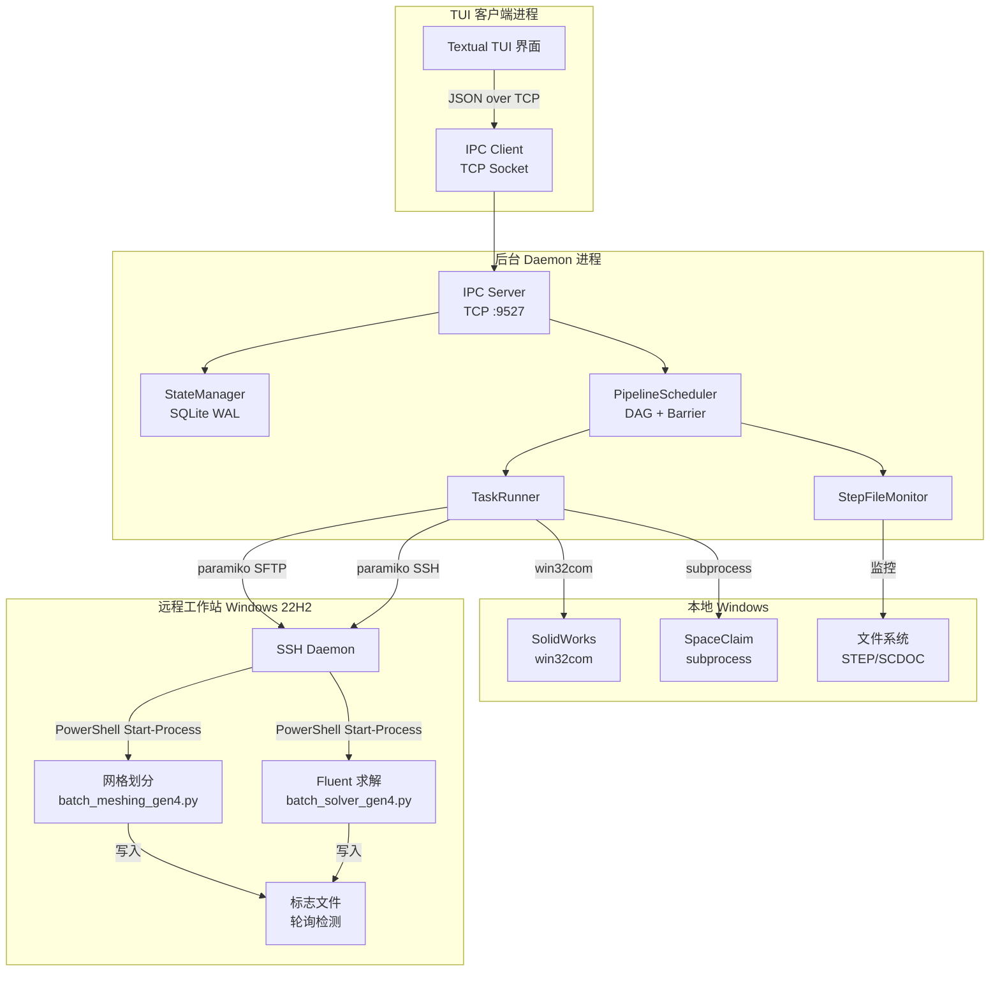

# 🚀 液氧甲烷火箭发动机仿真总控程序

> **Pipeline Daemon Engine v1.0** — 全自动流水线式 CFD 仿真调度系统

## 目录

- [项目概述](#项目概述)
- [系统架构](#系统架构)
- [流水线工作流](#流水线工作流)
- [目录结构](#目录结构)
- [技术栈](#技术栈)
- [IPC 通信协议](#ipc-通信协议)
- [状态管理 (SQLite)](#状态管理-sqlite)
- [DAG 调度器设计](#dag-调度器设计)
- [快速开始](#快速开始)
- [配置说明](#配置说明)
- [TUI 界面操作指南](#tui-界面操作指南)
- [命令参考](#命令参考)
- [文件说明](#文件说明)
- [环境变量](#环境变量)
- [注意事项](#注意事项)

---

## 项目概述

本项目是一个**全自动化的火箭发动机仿真流水线控制系统**，用于批量执行液氧甲烷火箭发动机喷注器构型的 CFD（计算流体动力学）仿真。系统通过自动化串联 SolidWorks 参数化建模 → SpaceClaim 几何转换 → 远程文件传输 → 网格划分 → Fluent 求解 五个阶段，将原本需要人工逐一手动操作的上百个构型仿真任务变为全自动无人值守运行。

### 核心特性

- **全自动流水线**: 从 Excel 参数表读取上百组构型参数，自动完成从建模到求解的全流程
- **C/S 分离架构**: 后台守护进程 (Daemon) + 终端交互界面 (TUI)，可独立部署
- **持久化状态管理**: 基于 SQLite WAL 模式，支持断点续传，Daemon 重启不丢失进度
- **DAG 任务调度**: 实现 Producer-Consumer 异步队列 + 全局同步屏障（Barrier）
- **文件系统事件驱动**: 通过文件监控检测输出文件完成，实现步骤间自动衔接
- **远程任务编排**: 通过 SSH 远程控制 Windows 工作站，使用 PowerShell `Start-Process` 启动独立后台进程
- **错误重试机制**: 每个步骤支持可配置的重试次数，提高鲁棒性
- **优雅关闭**: 支持 `Ctrl+C` 信号处理和 `quit full` 安全退出

---

## 系统架构



### 架构设计要点

| 组件 | 职责 | 技术选型 |
|------|------|----------|
| **PipelineDaemon** | 后台常驻进程，协调所有子系统 | Python 多线程 |
| **PipelineScheduler** | DAG 任务调度，全局屏障控制 | Producer-Consumer 队列 |
| **StateManager** | 持久化状态存储，支持并发读取 | SQLite (WAL mode) |
| **TaskRunner** | 执行各阶段具体操作 | win32com / subprocess / paramiko |
| **StepFileMonitor** | 检测 SW 宏导出的 STEP 文件 | 文件大小稳定检测 |
| **IPC Server/Client** | Daemon 与 TUI 间通信 | TCP Socket + JSON |
| **PipelineTUI** | 交互式终端界面 | Textual 框架 |

---

## 流水线工作流

每个构型按以下五阶段依次执行：


### 阶段详解

| 阶段 | 图标 | 操作 | 输入 | 输出 | 执行方式 |
|------|------|------|------|------|----------|
| **SW** | ⏳ | 执行 SolidWorks 宏，批量参数化导出 STEP | `model_gen4.SLDPRT` + Excel 参数表 | `model_gen4_{N}.step` | win32com (COM) |
| **SC** | ⟳ | SpaceClaim 无头启动，运行脚本转换几何 | `.step` 文件 | `model_gen4_{N}.scdoc` | subprocess 无头调用 |
| **Transfer** | ⏸ | 通过 SFTP 上传 scdoc 到远程工作站 | `.scdoc` 文件 | 远程 `.scdoc` | paramiko SFTP |
| **Meshing** | ⏳ | 远程运行网格划分脚本 | 远程 `.scdoc` | `.msh.h5` + 标志文件 | SSH 远程后台进程 |
| **Solver** | ⏸ | 远程运行 Fluent 求解器 | `.msh.h5` | `.cas.h5` + `.dat.h5` | SSH 远程后台进程 |

### 调度策略

1. **SW 阶段**: 一次性执行宏，批量导出所有构型的 STEP 文件
2. **SC → Transfer → Meshing**: 异步流水线，每个构型独立推进
3. **全局屏障 (Barrier)**: 所有构型的 Meshing 全部 `Completed` 后，统一解锁 Solver
4. **Solver 阶段**: 所有构型并行启动求解

### 状态流转

```
Waiting → Running → Retrying → Completed
                  ↘ Error → (reset) → Waiting
```

---

## 目录结构

```
AutoFluidSimulation/
├── main.py                  # 总控程序入口（支持 --daemon / --client / --all）
├── start_daemon.py          # 后台 Daemon 启动脚本（推荐）
├── start_client.py          # TUI 客户端启动脚本（推荐）
├── requirements.txt         # Python 依赖清单
├── README.md                # 本文件
│
├── engine/                  # 后台引擎模块
│   ├── __init__.py
│   ├── config.py            # 全局硬编码配置（路径、SSH、IPC、引擎参数）
│   ├── daemon.py            # PipelineDaemon：后台守护进程主类
│   ├── scheduler.py         # PipelineScheduler：DAG 任务调度器
│   ├── task_runner.py       # TaskRunner：各阶段任务执行器
│   ├── state_manager.py     # StateManager：SQLite 共享状态管理器
│   └── file_monitor.py      # StepFileMonitor：STEP 文件监控与稳定检测
│
├── client/                  # TUI 客户端模块
│   ├── __init__.py
│   ├── ipc_client.py        # IPCClient：与 Daemon 通信的 TCP 客户端
│   ├── tui.py               # PipelineTUI：Textual 交互式终端界面
│   └── widgets/             # 自定义 TUI 控件（预留）
│       └── __init__.py
│
├── ipc/                     # 进程间通信模块
│   ├── __init__.py
│   ├── protocol.py          # IPC 协议定义（命令常量、消息序列化）
│   └── server.py            # IPCServer：TCP Socket 命令服务器
│
└── utils/                   # 工具模块
    ├── __init__.py
    ├── excel_reader.py      # Excel 构型参数读取（openpyxl）
    ├── ssh_client.py        # RemoteWorkstation：SSH/SFTP 远程操作封装
    └── logger.py            # 统一日志工具
```

---

## 技术栈

### 运行环境

| 类别 | 要求 |
|------|------|
| **操作系统** | Windows 10/11（本地） |
| **Python** | 3.10+ |
| **必备软件** | SolidWorks 2020+, ANSYS SpaceClaim 2023 R1, ANSYS Fluent 2023 R1 |

### Python 依赖

| 包 | 版本 | 用途 |
|----|------|------|
| `textual` | ≥0.40.0 | TUI 框架（交互式终端界面） |
| `rich` | ≥13.0.0 | 终端美化（Textual 依赖） |
| `openpyxl` | ≥3.1.0 | Excel 参数表读取 |
| `pywin32` | ≥305 | SolidWorks COM 自动化接口 |
| `paramiko` | ≥3.0.0 | SSH/SFTP 远程工作站通信 |
| `watchdog` | ≥3.0.0 | 文件系统事件监控 |

安装依赖：

```powershell
pip install -r requirements.txt
```

### 外部依赖

- **SolidWorks**: 需要安装并注册 COM 接口，模型文件需位于指定路径
- **SpaceClaim**: 需要安装 ANSYS SpaceClaim 2023 R1，脚本需预先编写
- **远程 Windows 工作站**: 需启用 OpenSSH Server，安装 ANSYS Fluent + pyfluent，配置 Conda 环境

---

## IPC 通信协议

### 协议概述

TUI 客户端与 Daemon 之间通过 **TCP Socket (127.0.0.1:9527)** 通信，使用 **JSON 文本协议**（每条消息以 `\n` 结尾）。

### 请求格式

```json
{
    "command": "start",
    "params": {
        "config_name": 1,
        "step_name": "SW"
    },
    "request_id": "a1b2c3d4"
}
```

### 响应格式

```json
{
    "status": "ok",
    "data": { ... },
    "message": "流水线已启动",
    "request_id": "a1b2c3d4"
}
```

### 命令列表

| 命令 | 常量 | 说明 |
|------|------|------|
| `start` | `CMD_START` | 启动/继续流水线 |
| `pause` | `CMD_PAUSE` | 暂停流水线 |
| `stop` | `CMD_STOP` | 完全停止引擎 (quit full) |
| `check` | `CMD_CHECK` | 系统自检（本地+远程） |
| `get_all_status` | `CMD_GET_ALL_STATUS` | 获取所有构型状态 |
| `get_statistics` | `CMD_GET_STATISTICS` | 获取统计信息 |
| `get_engine_status` | `CMD_GET_ENGINE_STATUS` | 获取引擎运行状态 |
| `reset_step` | `CMD_RESET_STEP` | 重置构型步骤（支持 all 参数） |
| `clean_step` | `CMD_CLEAN_STEP` | 清理步骤文件（支持 all 参数） |

---

## 状态管理 (SQLite)

### 数据库表结构

```sql
-- 构型参数表
CREATE TABLE configs (
    config_name INTEGER PRIMARY KEY,  -- 构型编号
    param1 REAL NOT NULL,             -- 参数 1
    param2 REAL NOT NULL,             -- 参数 2
    param3 REAL NOT NULL,             -- 参数 3
    param4 REAL NOT NULL              -- 参数 4
);

-- 步骤状态表
CREATE TABLE steps (
    id INTEGER PRIMARY KEY AUTOINCREMENT,
    config_name INTEGER NOT NULL,     -- 所属构型
    step_name TEXT NOT NULL,          -- 步骤名称 (SW/SC/Transfer/Meshing/Solver)
    status TEXT NOT NULL DEFAULT 'Waiting',  -- 状态
    retry_count INTEGER NOT NULL DEFAULT 0,  -- 重试次数
    error_message TEXT DEFAULT '',    -- 错误信息
    updated_at REAL NOT NULL,         -- 更新时间戳
    UNIQUE(config_name, step_name)
);

-- 引擎状态表（单行记录）
CREATE TABLE engine_state (
    id INTEGER PRIMARY KEY CHECK(id = 1),
    status TEXT NOT NULL DEFAULT 'stopped',
    sw_macro_started INTEGER NOT NULL DEFAULT 0,
    global_barrier_met INTEGER NOT NULL DEFAULT 0
);
```

### 并发控制

- **WAL 模式**: 允许多个读进程（TUI）与一个写进程（Daemon）并发访问
- **线程锁**: Daemon 内使用 `threading.Lock` 串行化写操作
- **断点续传**: 状态持久化在磁盘，Daemon 重启自动恢复

---

## DAG 调度器设计

### Producer-Consumer 模型

```
┌─────────────┐     STEP 文件事件      ┌──────────────┐
│  SW 宏执行   │ ────────────────────→  │ FileMonitor  │
│  (一次性)    │                        │ (Producer)   │
└─────────────┘                        └──────┬───────┘
                                              │ 推送构型名称
                                              ▼
                                     ┌────────────────┐
                                     │   sc_queue     │
                                     │   (Queue)      │
                                     └──────┬─────────┘
                                              │ 取出构型
                              ┌───────────────┼───────────────┐
                              ▼               ▼               ▼
                         ┌─────────┐   ┌─────────┐   ┌─────────┐
                         │Worker 1 │   │Worker 2 │   │Worker 3 │
                         │SC→Trans │   │SC→Trans │   │SC→Trans │
                         │ →Mesh   │   │ →Mesh   │   │ →Mesh   │
                         └─────────┘   └─────────┘   └─────────┘
```

### 全局同步屏障 (Barrier)

```
所有构型的 Meshing 阶段
        │
        ▼
┌───────────────────┐
│  屏障检测线程      │  ← 轮询所有构型的 Meshing 状态
│  (Barrier Monitor) │
└────────┬──────────┘
         │ 所有 Meshing == Completed ?
         ▼
    ┌─────────┐
    │  YES    │ ───→ Solver Dispatcher 统一启动所有求解
    └─────────┘
    ┌─────────┐
    │  NO     │ ───→ 继续等待
    └─────────┘
```

### 暂停/继续机制

- `pause` 命令设置 `threading.Event`，工作线程在取下一个任务前检查
- 当前正在运行的步骤不会被中断（保证原子性）
- `start` 命令清除 Event，工作线程恢复取任务

---

## 快速开始

### 前置条件

1. 确保 SolidWorks 2020+ 已安装，COM 接口可用
2. 确保 ANSYS SpaceClaim 2023 R1 已安装在默认路径
3. 确保远程 Windows 工作站已启用 OpenSSH Server
4. 确保远程工作站已安装 ANSYS Fluent + Conda 环境 `pyfluent`
5. 将 Excel 参数表 `model_gen4.xlsx` 和 SolidWorks 模型 `model_gen4.SLDPRT` 放置在指定目录
6. 安装 Python 依赖：`pip install -r requirements.txt`

### 启动方式（推荐：双终端模式）

**终端 1** — 启动后台守护进程：

```powershell
python start_daemon.py
```

输出示例：

```
============================================================
  液氧甲烷火箭发动机仿真 - 后台调度引擎
  Pipeline Daemon Engine v1.0
============================================================

启动后将监听 IPC 连接，等待 TUI 客户端...
按 Ctrl+C 安全退出
```

**终端 2** — 启动 TUI 客户端：

```powershell
python start_client.py
```

### 其他启动方式

```powershell
# 仅启动 Daemon
python main.py --daemon

# 仅启动 TUI 客户端（前提：Daemon 已运行）
python main.py --client

# 同时启动（不推荐：Daemon 在后台线程中运行）
python main.py --all
```

---

## 配置说明

所有路径和参数在 `engine/config.py` 中集中管理，**使用前请务必修改**。

### 本地路径配置

```python
LOCAL_PATHS = {
    "sw_model": r"C:\...\model_gen4.SLDPRT",      # SolidWorks 初始模型
    "excel": r"C:\...\model_gen4.xlsx",            # Excel 参数表
    "sw_macro": r"C:\...\Macro1.swp",              # SW 宏文件
    "step_dir": r"C:\...\step",                    # STEP 输出目录
    "sc_exe": r"C:\Program Files\ANSYS Inc\v231\SCDM\SpaceClaim.exe",
    "sc_script": r"C:\...\spaceclaim_transit.scscript",  # SC 脚本
    "scdoc_dir": r"C:\...\scdoc",                  # SCDOC 输出目录
    "log_dir": r"C:\...\logs",                     # 日志目录
}
```

### 远程工作站配置

```python
REMOTE_CONFIG = {
    "host": "172.17.135.240",       # 远程工作站 IP
    "port": 22,                     # SSH 端口
    "username": "ps",               # SSH 用户名
    "password": "",                 # SSH 密码（或通过环境变量设置）
    "root_dir": r"D:\xkz_1020",     # 远程工程根目录
    "scdoc_dir": r"D:\xkz_1020\scdoc",
    "msh_dir": r"D:\xkz_1020\msh",
    "result_dir": r"D:\xkz_1020\case",
    "conda_env": "pyfluent",        # Conda 环境名
    "meshing_script": r"D:\xkz_1020\batch_meshing_gen4.py",
    "solver_script": r"D:\xkz_1020\batch_solver_gen4.py",
    "flag_dir": r"D:\xkz_1020\flags",
}
```

### 引擎参数

```python
ENGINE_CONFIG = {
    "watchdog_interval": 1.0,       # 文件监控轮询间隔（秒）
    "sw_macro_timeout": 3600,       # SW 宏超时（秒）
    "sc_timeout": 300,              # SC 脚本超时（秒）
    "transfer_timeout": 120,        # 文件传输超时（秒）
    "meshing_timeout": 600,         # 网格划分超时（秒）
    "solver_timeout": 7200,         # 求解超时（秒）
    "max_retries": 3,               # 最大重试次数
    "state_refresh_interval": 0.5,  # TUI 状态刷新间隔（秒）
}
```

---

## TUI 界面操作指南

### 界面布局

```
┌─────────────────────────────────────────────────┐
│  🚀 液氧甲烷火箭发动机仿真总控程序 v1.0          │  ← 标题栏
│  引擎状态: Running | 屏障: 未通过 | 构型: 12     │  ← 信息栏
├─────────────────────────────────────────────────┤
│  构型  │  SW  │  SC  │ 传输 │ 网格 │ 求解       │  ← 状态表格
│  ──────┼──────┼──────┼──────┼──────┼──────      │
│    1   │  ✓   │  ✓   │  ✓   │  ⏳  │  ⏸       │
│    2   │  ✓   │  ⏳   │  ⏸   │  ⏸   │  ⏸       │
│    3   │  ✓   │  ✓   │  ⟳   │  ⏸   │  ⏸       │
│   ...  │ ...  │ ...  │ ...  │ ...  │ ...        │
├─────────────────────────────────────────────────┤
│  [2024-01-01 12:00:00] 构型 1 Mesh 完成          │  ← 日志面板
├─────────────────────────────────────────────────┤
│  > _                                             │  ← 命令输入
│  [start] [pause] [check] [reset] [clean] [quit] │  ← 快捷按钮
└─────────────────────────────────────────────────┘
```

### 状态图标

| 图标 | 状态 | 颜色 | 含义 |
|------|------|------|------|
| ✓ | Completed | 绿色 | 该步骤已成功完成 |
| ⏳ | Running | 黄色闪烁 | 该步骤正在执行中 |
| ⟳ | Retrying | 橙色 | 该步骤正在重试中 |
| ⏸ | Waiting | 灰色 | 该步骤等待前置步骤完成 |
| ✗ | Error | 红色 | 该步骤执行出错 |

### 快捷键

| 快捷键 | 功能 |
|--------|------|
| `Ctrl+C` | 退出 TUI（仅退出界面，Daemon 继续运行） |
| `Ctrl+Q` | 同上 |
| `Y` | 确认对话框 |
| `N` / `Esc` | 取消对话框 |

---

## 命令参考

### TUI 命令

| 命令 | 功能 | 示例 |
|------|------|------|
| `start` | 启动或继续流水线 | `start` |
| `pause` | 暂停流水线 | `pause` |
| `check` | 系统自检 | `check` |
| `reset <构型\|all> <步骤\|all>` | 重置构型步骤状态（两个参数必填） | `reset 5 SW`、`reset all SW`、`reset all all` |
| `clean <构型\|all> <步骤\|all>` | 清理输出文件（两个参数必填） | `clean 5 SW`、`clean all SW`、`clean all all` |
| `status` | 显示统计信息 | `status` |
| `quit` | 退出 TUI（Daemon 继续运行） | `quit` |
| `quit full` | 完全停止后台引擎 | `quit full` |

### reset 命令说明

- `reset 5 SW` — 重置构型 5 的 SW 阶段及所有后续步骤为 Waiting
- `reset 5 all` — 重置构型 5 的所有步骤
- `reset all SW` — 重置所有构型的 SW 步骤
- `reset all all` — 重置所有构型的所有步骤，并清除全局屏障状态

### clean 命令说明

- `clean 5 SW` — 清理构型 5 的 SW 步骤文件
- `clean 5 all` — 清理构型 5 的所有步骤文件
- `clean all SW` — 清理所有构型的 SW 步骤文件
- `clean all all` — 清理所有构型的所有步骤文件

---

## 文件说明

### 核心文件

| 文件 | 说明 |
|------|------|
| `engine/config.py` | **全局配置中心**，所有路径、SSH 信息、引擎参数在此集中定义 |
| `engine/daemon.py` | 后台守护进程，协调 StateManager、Scheduler、TaskRunner、IPC Server |
| `engine/scheduler.py` | DAG 调度器，实现 Producer-Consumer 异步队列和全局屏障 |
| `engine/task_runner.py` | 任务执行器，封装 SW/SC/Transfer/Meshing/Solver 各阶段操作 |
| `engine/state_manager.py` | SQLite 状态管理器，支持断点续传 |
| `engine/file_monitor.py` | STEP 文件监控器，检测文件写入完成 |

### 客户端文件

| 文件 | 说明 |
|------|------|
| `client/tui.py` | Textual 框架构建的 TUI 界面，支持状态表格、日志、命令输入 |
| `client/ipc_client.py` | IPC 客户端，通过 TCP 向 Daemon 发送命令 |

### IPC 文件

| 文件 | 说明 |
|------|------|
| `ipc/protocol.py` | 协议定义（命令常量、消息序列化/反序列化） |
| `ipc/server.py` | IPC 服务器，监听 TCP 连接处理客户端命令 |

### 工具文件

| 文件 | 说明 |
|------|------|
| `utils/excel_reader.py` | 读取 Excel 参数表，解析构型配置 |
| `utils/ssh_client.py` | SSH/SFTP 客户端封装，支持后台进程启动和文件传输 |
| `utils/logger.py` | 统一日志工具，同时输出到终端和文件 |

---

## 环境变量

| 变量名 | 说明 | 默认值 |
|--------|------|--------|
| `AUTOFLUID_SSH_HOST` | 远程工作站 SSH 地址 | `172.17.135.240` |
| `AUTOFLUID_SSH_PORT` | SSH 端口 | `22` |
| `AUTOFLUID_SSH_USER` | SSH 用户名 | `ps` |
| `AUTOFLUID_SSH_PASSWORD` | SSH 密码 | 空（需手动设置） |

**设置环境变量示例**（PowerShell）：

```powershell
$env:AUTOFLUID_SSH_PASSWORD = "your_password"
```

建议将密码设置为**用户环境变量**而非在代码中硬编码。

---

## 注意事项

### 运行前提

1. **SolidWorks 必须已安装并注册 COM 接口**，程序通过 `win32com.client.Dispatch("SldWorks.Application")` 调用
2. **SpaceClaim 脚本需预先编写**（`.scscript` 格式），确保无头模式可正常运行
3. **远程工作站必须开启 OpenSSH Server**，且允许密码登录
4. **Excel 参数表格式**：第 1-2 行为表头（自动跳过），第 3 行起为数据行（构型名 + 4 个参数）
5. **网络连通性**：本地需能 ping 通远程工作站 IP

### 最佳实践

- **生产环境推荐使用双终端模式**（`start_daemon.py` + `start_client.py`），便于观察日志和独立重启
- **首次运行前先执行 `check` 命令**进行系统自检，确认所有依赖就绪
- **定期检查日志文件**（位于 `log_dir` 目录），排查异常
- **不要在生产环境使用 `reset all` 或 `clean all`**，除非确认需要完全重置
- **SQLite 数据库文件** (`pipeline_state.db`) 位于 `log_dir`，可用任何 SQLite 工具直接查询状态

### 故障排查

| 问题 | 可能原因 | 解决方式 |
|------|----------|----------|
| `[CONFIG WARNING]` 提示 | 路径配置错误 | 检查 `engine/config.py` 中的路径是否正确 |
| IPC 连接失败 | Daemon 未启动或端口被占用 | 先启动 `start_daemon.py`，检查 9527 端口 |
| SW 宏执行失败 | SolidWorks 未安装或 COM 注册问题 | 确认 SW 已安装，尝试手动运行宏 |
| SSH 连接失败 | 远程工作站未开启 SSH 或密码错误 | 检查 IP、端口、用户名、密码 |
| SC 脚本超时 | SpaceClaim 脚本出错或路径问题 | 检查 `.scscript` 文件和输入 STEP 文件 |

### 开发相关

- 状态数据库路径：`LOCAL_PATHS["log_dir"] + "\\pipeline_state.db"`
- IPC 默认端口：`9527`
- 日志格式：`[时间] [级别] [模块名] 消息内容`
- TUI 界面使用 Textual CSS 进行样式定制（定义在 `PipelineTUI.CSS`）

---

## 许可证

本项目用于学术研究（毕业设计），未经许可不得用于商业用途。

---

> **开发日期**: 2024-2026
> **适用场景**: 液氧甲烷火箭发动机喷注器构型批量 CFD 仿真
